## はじめに 🌟

コンパイラーという言葉を聞くと、いきなり巨大なソースコードや難しい最適化を思い浮かべるかもしれません。  
でも、その入口にある「文字を読み、意味のある部品に分ける」という処理は、集合・関係・関数・オートマトンという数学の道具でかなり見通しよく整理できます。

たとえば C# の次の 1 行を見てみます。

```csharp
var total = price + tax;
```

人間には「変数 `total` に `price + tax` を代入している」と読めます。  
一方でコンパイラーは、まず文字列を `var`、`total`、`=`、`price`、`+`、`tax`、`;` のようなトークンに分けます。

```text
"var total = price + tax;"
  -> var / total / = / price / + / tax / ;
```

この記事では、集合から始めて、言語と正規表現、DFA / NFA、自動販売機のオートマトン、字句解析へ進み、最後に Roslyn の API とソースコードに接続していきます。  
「理論が実装にどうつながるのか」をゆっくり眺める読み物として書いています📚

流れを先に描くと、次のようになります。

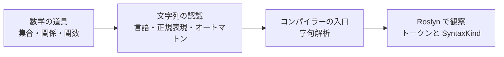

:::message
Roslyn については [.NET コンパイラ プラットフォーム SDK](https://learn.microsoft.com/ja-jp/dotnet/csharp/roslyn-sdk/?WT.mc_id=DT-MVP-5004827) を参照します。公式ドキュメントでは、Roslyn はコンパイラーが作るモデルへのアクセスを提供し、コンパイラーを API プラットフォームとして扱えるようにするものとして説明されています。
:::

次の章では、まず「文字を分類する」ための土台として集合を見ていきます。

## 集合：文字を「仲間分け」する

集合は、対象をひとまとまりとして扱う考え方です。  
字句解析の入口では、入力文字を「数字」「英字」「空白」「記号」のように分類します。これはまさに集合の発想です。

| 集合 | 例 | 字句解析での使い道 |
|---|---|---|
| 🔢 数字 | `{0, 1, 2, ..., 9}` | 数値リテラルを読む |
| 🔤 英字 | `{a, b, c, ..., z, A, ..., Z}` | 識別子やキーワードを読む |
| ⬜ 空白 | `{space, tab, newline}` | トークン間の区切りとして読む |
| 🧩 記号 | `{+, -, =, ;, (, )}` | 演算子や区切り記号として読む |

簡単な C# 風の分類関数を書くと、次のようになります。

```csharp
static string Classify(char c)
{
    if (char.IsDigit(c)) return "Digit";
    if (char.IsLetter(c) || c == '_') return "Letter";
    if (char.IsWhiteSpace(c)) return "Whitespace";
    return "Symbol";
}

Console.WriteLine(Classify('a')); // Letter
Console.WriteLine(Classify('7')); // Digit
Console.WriteLine(Classify('+')); // Symbol
```

このコードは、1 文字 `c` がどの集合に属するかを判定しています。  
`char.IsDigit(c)` は「数字の集合に入っているか」、`char.IsLetter(c)` は「文字の集合に入っているか」を調べる操作だと考えられます。

:::message
集合を「数学の記号」としてだけ見ると遠く感じますが、実装では `if` 文や分類関数として自然に現れます。
:::

集合で文字を分類できると、次は「入力と結果をどう対応させるか」を関係や関数で表せます。

## 関係 / 関数：入力と状態を対応させる

関係は「何かと何かが対応している」という考え方です。  
関数は、その中でも入力に対して出力が 1 つに決まる対応です。オートマトンでは、現在の状態と入力文字から次の状態を決める遷移関数が登場します。

たとえば、識別子を読む小さな状態遷移を考えます。

| 現在の状態 | 入力の分類 | 次の状態 |
|---|---|---|
| 🚪 Start | Letter | Identifier |
| 🏷️ Identifier | Letter | Identifier |
| 🏷️ Identifier | Digit | Identifier |
| 🏷️ Identifier | Whitespace | Done |
| 🏷️ Identifier | Symbol | Done |

これをコードにすると、次のような関数になります。

```csharp
enum State
{
    Start,
    Identifier,
    Done,
    Error
}

static State Next(State state, string inputClass)
{
    return (state, inputClass) switch
    {
        (State.Start, "Letter") => State.Identifier,
        (State.Identifier, "Letter") => State.Identifier,
        (State.Identifier, "Digit") => State.Identifier,
        (State.Identifier, "Whitespace") => State.Done,
        (State.Identifier, "Symbol") => State.Done,
        _ => State.Error
    };
}
```

この `Next` 関数は、現在の状態と入力分類を受け取り、次の状態を返します。  
つまり、`(状態, 入力) -> 次の状態` という対応を C# の `switch` 式で書いたものです。

状態遷移を図にすると、さらに見通しがよくなります。

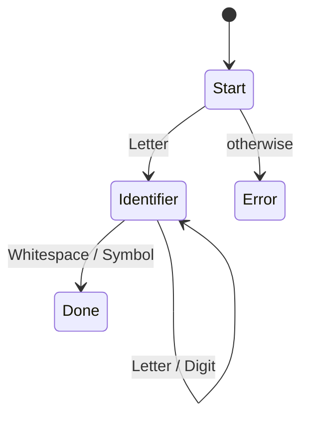

関数として遷移を書けるようになると、次は「そもそも受け入れたい文字列の集まり」を言語として考えられます。

## 言語と正規表現：受け入れたい文字列の集合

形式言語の文脈では、言語は文字列の集合です。  
たとえば「C# の識別子っぽいもの」を厳密な仕様ではなく学習用に簡略化すると、次のような文字列の集合として見られます。

```text
L_identifier = { "x", "total", "_value", "price2", ... }
```

この集合を正規表現で近似すると、次のように書けます。

```regex
[A-Za-z_][A-Za-z0-9_]*
```

意味は次のとおりです。

| 部分 | 意味 | 例 |
|---|---|---|
| 🔤 `[A-Za-z_]` | 先頭は英字または `_` | `x`, `_` |
| 🔁 `[A-Za-z0-9_]*` | 2 文字目以降は英数字または `_` の 0 回以上 | `otal`, `2`, `_value` |
| ✅ 全体 | 識別子として扱いたい文字列 | `total`, `_count`, `price2` |

C# で試すなら、次のようになります。

```csharp
using System.Text.RegularExpressions;

var pattern = new Regex(@"^[A-Za-z_][A-Za-z0-9_]*$");

Console.WriteLine(pattern.IsMatch("total"));  // True
Console.WriteLine(pattern.IsMatch("price2")); // True
Console.WriteLine(pattern.IsMatch("2price")); // False
Console.WriteLine(pattern.IsMatch("+"));      // False
```

このコードは、文字列全体が識別子の形に合っているかを判定しています。  
`^` と `$` は文字列の先頭と末尾を表すため、途中だけ一致するのではなく、全体がルールに合うかを見るのがポイントです。

正規表現で書けるパターンは、オートマトンで状態遷移として表すこともできます。次は DFA / NFA に進みます。

## DFA / NFA：読む位置によって状態を変える

DFA（Deterministic Finite Automaton、決定性有限オートマトン）は、現在の状態と入力によって次の状態が 1 つに決まる機械です。  
NFA（Nondeterministic Finite Automaton、非決定性有限オートマトン）は、次の状態が複数あり得る機械です。

まずは先ほどの識別子パターンを DFA として描いてみます。

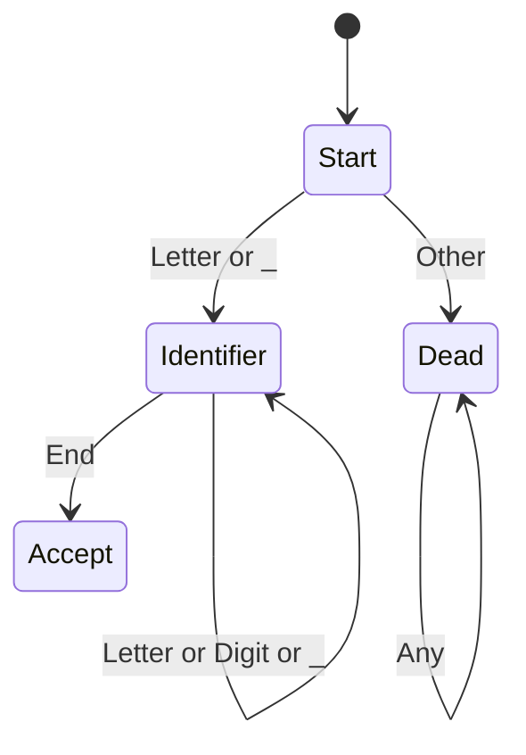

この図では、`Identifier` まで進めれば、入力の終わりで受理できます。  
一方、先頭が数字や `+` のような記号なら `Dead` に進み、識別子としては受け入れません。

### 有限オートマトンの肝：履歴を全部持たない（ステップで理解）

ここがとても大事です。  
DFA が「有限」であるとは、入力文字列そのものを丸ごと記憶しない、ということでもあります。保持するのは **現在状態だけ** です。

同じ入力 `abc123` を読みながら、次の 2 つを比べてみます。

| 方式 | 何を覚えるか | メモリの増え方 |
|---|---|---|
| 🧠 全履歴を保持する方式 | `a`, `ab`, `abc`, ... と過去すべて | 入力長に比例して増える |
| 🤖 DFA 的な方式 | `Start` / `Identifier` / `Dead` など現在状態だけ | 状態数ぶんで頭打ち |

ステップで追うと、次のようになります。

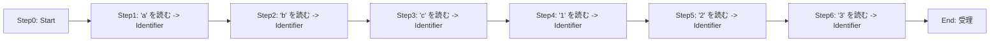

`Step6` の時点で必要なのは「今 `Identifier` 状態にいる」という事実です。  
`Step1` で読んだ文字が `a` だったことを、機械は覚えていなくても判定できます。

コードで書くと、履歴文字列を保存しなくても判定できることが見えます。

```csharp
enum IdState { Start, Identifier, Dead }

static IdState Step(IdState state, char c)
{
    return state switch
    {
        IdState.Start when char.IsLetter(c) || c == '_' => IdState.Identifier,
        IdState.Identifier when char.IsLetterOrDigit(c) || c == '_' => IdState.Identifier,
        _ => IdState.Dead
    };
}

static bool AcceptIdentifierByStateOnly(string text)
{
    var state = IdState.Start;

    foreach (var c in text)
    {
        state = Step(state, c);
        if (state == IdState.Dead) return false;
    }

    return state == IdState.Identifier;
}
```

このコードは、`state` という 1 つの変数しか更新しません。  
`text` を 1 文字ずつ読むたびに「次の状態」へ進むだけで、過去に読んだ全文字を別途保存していない点がポイントです。

:::message
厳密には、実装でトークン文字列（lexeme）をあとで使うためにバッファへ積むことはあります。  
ただし「受理できるか」の判定そのものは、有限個の状態で進められる、というのが有限オートマトンの本質です。
:::

簡単なシミュレーターを書くと、次のようになります。

```csharp
static bool IsSimpleIdentifier(string text)
{
    if (string.IsNullOrEmpty(text)) return false;

    for (var i = 0; i < text.Length; i++)
    {
        var c = text[i];

        if (i == 0)
        {
            if (!(char.IsLetter(c) || c == '_')) return false;
        }
        else
        {
            if (!(char.IsLetterOrDigit(c) || c == '_')) return false;
        }
    }

    return true;
}

Console.WriteLine(IsSimpleIdentifier("total"));  // True
Console.WriteLine(IsSimpleIdentifier("2total")); // False
```

このコードは、状態を明示的な `enum` で持っていませんが、`i == 0` かどうかで「先頭を読んでいる状態」と「2 文字目以降を読んでいる状態」を分けています。  
つまり、ループと条件分岐の中に小さな DFA が埋め込まれていると見られます。

:::message
実用的な字句解析器（lexer）は、必ずしも教科書どおりの状態表をそのまま持つとは限りません。高速化やエラー処理の都合で、手続き的なコードとして状態遷移が表現されることがあります。
:::

ここでは DFA を中心に進めます。NFA は「同じ入力から複数の候補へ進める」と考えると分かりやすく、たとえば `ab` または `ac` を受け入れる小さな NFA は次のように描けます。

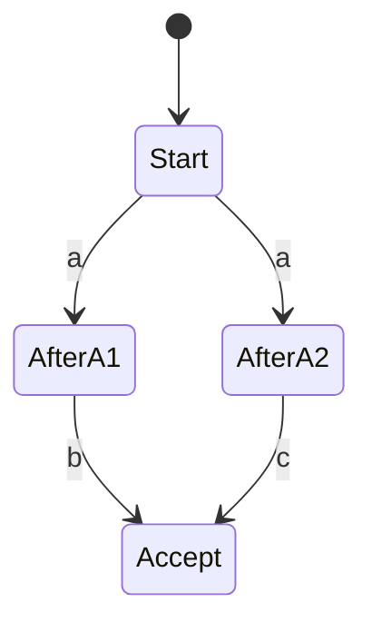

この図では、`a` を読んだあとに「次は `b` を期待する道」と「次は `c` を期待する道」の両方を候補として持てます。実装では DFA に変換したり、候補集合を管理したりして扱います。

ここまでの状態遷移をもっと身近にするために、次は自動販売機の例でオートマトンを見てみます。

## 自動販売機オートマトン：状態と入力でふるまいが決まる

ここで一度、状態遷移の感覚を身近な例で確認します。オートマトンを身近に感じる例として、自動販売機を考えてみます。  
100 円の飲み物を買う自動販売機があり、50 円玉と 100 円玉だけを受け付けるとします。

| 状態 | 意味 | 次にできること |
|---|---|---|
| 🪙 0円 | まだ投入なし | 50 円または 100 円を入れる |
| 🪙 50円 | 50 円投入済み | さらに 50 円または 100 円を入れる |
| ✅ 購入可能 | 100 円以上 | 商品を出す |

状態遷移は次のようになります。

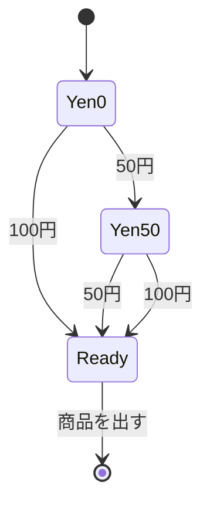

コードにすると、かなり素直です。

```csharp
enum VendingState
{
    Yen0,
    Yen50,
    Ready
}

static VendingState Insert(VendingState state, int coin)
{
    return (state, coin) switch
    {
        (VendingState.Yen0, 50) => VendingState.Yen50,
        (VendingState.Yen0, 100) => VendingState.Ready,
        (VendingState.Yen50, 50) => VendingState.Ready,
        (VendingState.Yen50, 100) => VendingState.Ready,
        _ => state
    };
}
```

この `Insert` 関数は、今の投入金額に対応する状態と、新しく入った硬貨をもとに、次の状態を返します。  
自動販売機は「過去に何が起きたか」をすべて覚える必要はなく、現在の状態だけを覚えていれば次の判断ができます。

字句解析も同じです。  
「今は識別子を読んでいる」「今は数値を読んでいる」「今は文字列リテラルを読んでいる」という状態を持ち、次の文字でふるまいを変えます。

自動販売機で状態の感覚をつかめたので、次はコンパイラーの入口である字句解析に戻ります。

## 字句解析：文字列をトークンに分解する

字句解析（lexical analysis）は、ソースコードの文字列をトークンに分ける処理です。  
トークンは、コンパイラーが次の段階で扱いやすい最小単位だと考えると分かりやすいです。

たとえば、次の C# コードを考えます。

```csharp
var answer = 40 + 2;
```

字句解析の結果を簡略化すると、次のようになります。

| トークンの文字列 | トークンの種類 | 説明 |
|---|---|---|
| 🏷️ `var` | IdentifierToken | 文脈キーワード（contextual keyword）として解釈され得る識別子 |
| 🏷️ `answer` | Identifier | 識別子 |
| ➡️ `=` | EqualsToken | 代入演算子 |
| 🔢 `40` | NumericLiteralToken | 数値リテラル |
| ➕ `+` | PlusToken | 加算演算子 |
| 🔢 `2` | NumericLiteralToken | 数値リテラル |
| 🔚 `;` | SemicolonToken | 文の区切り |

字句解析器の疑似コードは、次のように表せます。

```csharp
while (!EndOfText)
{
    if (CurrentIsWhitespace())
    {
        ReadWhitespace();
    }
    else if (CurrentIsLetterOrUnderscore())
    {
        ReadIdentifierOrKeyword();
    }
    else if (CurrentIsDigit())
    {
        ReadNumber();
    }
    else
    {
        ReadOperatorOrPunctuation();
    }
}
```

この疑似コードは、現在位置の文字を見て「空白」「識別子 / キーワード」「数値」「記号」のどれとして読むかを分岐しています。  
各 `Read...` の中では、さらに次の文字を読みながらトークンの終わりを探します。ここに DFA 的な考え方が入っています。

:::message
`var` は C# では常に予約語として扱われる語ではなく、特定の文脈で意味を持つ contextual keyword として説明されます。Roslyn API で `token.Kind()` を見ると `IdentifierToken` として現れ、パーサー側の文脈によって「暗黙型の `var`」として解釈される、と分けて考えると混乱しにくいです。詳しくは [C# キーワード](https://learn.microsoft.com/ja-jp/dotnet/csharp/language-reference/keywords/?WT.mc_id=DT-MVP-5004827) を参照してください。
:::

:::message alert
ここでのコードは Roslyn の実装をそのまま転載したものではなく、理解のために短くした疑似コードです。実際の Roslyn は、言語仕様、エラー回復、trivia、補間文字列など多くのケースを扱います。
:::

トークンという単位が分かったところで、次は Roslyn API を使って実際にトークンを見てみます。

## Roslyn API でトークンを見る

Roslyn を使うと、C# のコードを構文木として解析し、その中のトークンを API から取得できます。  
公式ドキュメントで説明されているように、Roslyn はコンパイラーが内部で作るモデルへアクセスする入口を提供します。

最小のコンソールアプリで試すなら、次のような流れです。

```powershell
dotnet new console -n RoslynTokenWalk
cd RoslynTokenWalk
dotnet add package Microsoft.CodeAnalysis.CSharp
```

これらのコマンドは、新しいコンソールアプリを作り、C# の構文解析 API を使うために `Microsoft.CodeAnalysis.CSharp` パッケージを追加しています。  
既存プロジェクトで試す場合は、最後の `dotnet add package` だけを実行すれば十分です。

次に、`Program.cs` を次のように書き換えます。

```csharp
using Microsoft.CodeAnalysis.CSharp;

var code = "var answer = 40 + 2;";
var tree = CSharpSyntaxTree.ParseText(code);
var root = tree.GetRoot();

foreach (var token in root.DescendantTokens())
{
    Console.WriteLine($"{token.Kind(),-25} '{token.Text}'");
}
```

このコードでは、`CSharpSyntaxTree.ParseText(code)` で文字列を C# の構文木に変換しています。  
その後、`GetRoot()` で構文木の根を取り、`DescendantTokens()` で構文木に含まれるトークンを順番に取り出しています。

出力イメージは次のようになります。

```text
IdentifierToken           'var'
IdentifierToken           'answer'
EqualsToken               '='
NumericLiteralToken       '40'
PlusToken                 '+'
NumericLiteralToken       '2'
SemicolonToken            ';'
EndOfFileToken            ''
```

ここで出てくる `IdentifierToken`、`NumericLiteralToken`、`PlusToken` などは、Roslyn の `SyntaxKind` として表現されます。  
つまり、字句解析の結果は「文字列」だけでなく、「どんな種類のトークンか」という分類情報も持っているわけです。

Roslyn API でトークンを観察できたので、次は「Roslyn のソースコードを読むための語彙」をそろえます。  
ここを丁寧に押さえると、`Lexer.cs` が単なる巨大な `switch` 文ではなく、理論で見た状態遷移の実装として読めるようになります。

## Roslyn を読むための用語整理

Roslyn のソースを読む前に、用語の対応を整理します。  
ここでのポイントは、教科書の「文字列・状態・受理」という言葉が、Roslyn では `SourceText`、`SyntaxKind`、`SyntaxToken`、`SyntaxTrivia` などの型やプロパティとして現れることです。

| 用語 | 意味 | Roslyn で見る例 |
|---|---|---|
| 📄 SourceText | ソースコード全体の文字列を表す入力 | `CSharpSyntaxTree.ParseText(SourceText)` |
| 🔍 lexeme | まだ分類前の、入力から切り出した文字列 | `answer`, `40`, `+` |
| 🏷️ token | lexeme に種類を付けたもの | `IdentifierToken`, `NumericLiteralToken` |
| 🧾 SyntaxKind | token / node / trivia の種類を表す enum | `SyntaxKind.PlusToken` |
| 🧱 SyntaxToken | 構文木の中にある token の公開 API 表現 | `token.Kind()`, `token.Text` |
| 📝 SyntaxTrivia | 空白・改行・コメントのように、構文の外側に付く情報 | `WhitespaceTrivia`, `SingleLineCommentTrivia` |
| 🌳 SyntaxNode | token を組み合わせた構文上のまとまり | `LocalDeclarationStatementSyntax` |
| 🧪 Diagnostic | エラーや警告など、解析中に見つかった問題 | `token.GetDiagnostics()` |
| 🟩 green tree | 親や位置を持たない内部表現の構文木 | `InternalSyntax` 側の node / token |
| 🟥 red tree | 親・位置・SyntaxTree への参照を持つ公開 API 側の構文木 | `GetRoot()` で触る node / token |

たとえば、次のコードで token の中身を少し詳しく観察できます。

```csharp
using Microsoft.CodeAnalysis.CSharp;

var code = "var answer = 40 + 2;";
var root = CSharpSyntaxTree.ParseText(code).GetRoot();

foreach (var token in root.DescendantTokens())
{
    Console.WriteLine($"""
        Kind      : {token.Kind()}
        Text      : '{token.Text}'
        ValueText : '{token.ValueText}'
        Span      : {token.Span}
        FullSpan  : {token.FullSpan}
        """);
}
```

このコードは、Roslyn が作った `SyntaxToken` から、種類・元の文字列・値としての文字列・位置情報を取り出しています。  
`Span` は token 本体の範囲、`FullSpan` は前後の trivia も含む範囲です。空白やコメントを含めてソースを再構成できるのは、この trivia を Roslyn が捨てずに保持しているからです。

構造を図にすると、1 つの token は次のように見られます。

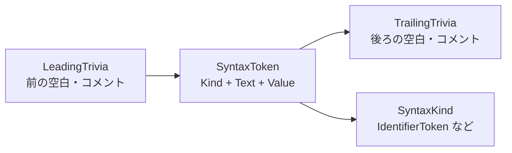

:::message
字句解析の学習では空白やコメントを単に「読み飛ばす」と説明しがちです。Roslyn では、フォーマッターやリファクタリングで元のコード形を保つ必要があるため、空白やコメントを `SyntaxTrivia` として構文木に残します。
:::

用語がそろったので、ここから実際の Roslyn ソースを読みます。

## Roslyn ソースを読む入口：ParseText から Lexer へ

Roslyn の入口として、この記事では `CSharpSyntaxTree.ParseText` を読みます。  
`.NET コンパイラ プラットフォーム SDK` の公式ドキュメントでは、Roslyn はコンパイラーが作るモデルへのアクセスを提供し、コンパイラーを API プラットフォームとして扱えるようにするものとして説明されています。

参照する一次情報は次のファイルです。リンク先は 2026-06-13 時点で確認した commit に固定しています。

| ソース | 読む目的 |
|---|---|
| 🌳 [`CSharpSyntaxTree.cs`](https://github.com/dotnet/roslyn/blob/6bcf630a1597eca8bd82ac9f85b935826ba4d44f/src/Compilers/CSharp/Portable/Syntax/CSharpSyntaxTree.cs) | `ParseText` が `InternalSyntax.Lexer` と `InternalSyntax.LanguageParser` を作る流れを見る |
| 🧭 [`Lexer.cs`](https://github.com/dotnet/roslyn/blob/6bcf630a1597eca8bd82ac9f85b935826ba4d44f/src/Compilers/CSharp/Portable/Parser/Lexer.cs) | `Lex`、`LexSyntaxToken`、`ScanSyntaxToken` の順に token が作られる流れを見る |
| 🏷️ [`SyntaxKind.cs`](https://github.com/dotnet/roslyn/blob/6bcf630a1597eca8bd82ac9f85b935826ba4d44f/src/Compilers/CSharp/Portable/Syntax/SyntaxKind.cs) | `PlusToken`、`IdentifierToken`、`WhitespaceTrivia` などの分類名を見る |
| 🧱 [`SyntaxToken.cs`（公開 API）](https://github.com/dotnet/roslyn/blob/6bcf630a1597eca8bd82ac9f85b935826ba4d44f/src/Compilers/Core/Portable/Syntax/SyntaxToken.cs) | `Text`、`ValueText`、`Span`、`LeadingTrivia` など、利用者が触る token の形を見る |
| 🟩 [`SyntaxToken.cs`（InternalSyntax）](https://github.com/dotnet/roslyn/blob/6bcf630a1597eca8bd82ac9f85b935826ba4d44f/src/Compilers/CSharp/Portable/Syntax/InternalSyntax/SyntaxToken.cs) | lexer が `SyntaxFactory` 経由で作る内部 token の形を見る |
| 🔤 [`SyntaxFacts.cs`](https://github.com/dotnet/roslyn/blob/6bcf630a1597eca8bd82ac9f85b935826ba4d44f/src/Compilers/CSharp/Portable/Syntax/SyntaxFacts.cs) | 文字や `SyntaxKind` に関する判定ヘルパーを見る |

`CSharpSyntaxTree.ParseText` の中核は、かなり大きく単純化すると次の流れです。

```csharp
using var lexer = new InternalSyntax.Lexer(text, options);
using var parser = new InternalSyntax.LanguageParser(lexer, oldTree: null, changes: null);
var compilationUnit = parser.ParseCompilationUnit().CreateRed();
```

これは実際の `CSharpSyntaxTree.cs` に出てくる流れを短く抜き出したものです。  
ここで Roslyn がしていることを、1 行ずつ読むと次のようになります。

| 行 | 意味 |
|---|---|
| 🧭 `new InternalSyntax.Lexer(...)` | 文字列を token に分ける字句解析器を作る |
| 🧩 `new InternalSyntax.LanguageParser(...)` | token を受け取り、文・式・宣言などの構文に組み立てる parser を作る |
| 🌳 `ParseCompilationUnit()` | C# ファイル全体を表す構文木の根を作る |
| 🟥 `CreateRed()` | 内部表現から、公開 API として辿れる red tree を作る |

この 3 行から分かるのは、`ParseText` がいきなり完成した構文木を魔法のように作っているわけではない、ということです。  
まず `Lexer` が `SourceText` を token に分け、その token を `LanguageParser` が受け取り、最後に `CompilationUnitSyntax` という「C# ファイル全体」を表すノードへまとめています。

`CreateRed()` も重要です。Roslyn の内部では、変更に強くメモリ効率のよい green tree を作り、それを公開 API として扱いやすい red tree に包みます。  
私たちが `tree.GetRoot()` や `root.DescendantTokens()` で触っているのは、この red tree 側です。

これを Mermaid 図にすると、次のようになります。

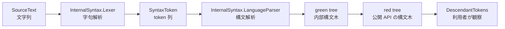

ここで重要なのは、`ParseText` は lexer だけで終わらないことです。  
Roslyn API から見える `SyntaxToken` は、lexer が切り出した情報を parser が構文木に組み込み、red tree として公開したものです。

## Lexer.cs を読む：字句解析の心臓部

次に `Lexer.cs` を読みます。  
Roslyn の lexer は教科書の DFA をそのまま `enum State` として書いたものではありませんが、「現在位置」「現在の lexer mode」「次の文字」「tokenInfo」という状態を持って入力を進めます。

まず読みたいメソッドは、この順番です。

| 読む順 | メソッド | 何をしているか |
|---|---|---|
| 1 | 🧭 `Lex` | 現在の `LexerMode` に応じて、通常 token・directive・XML doc comment などの読み方を選ぶ |
| 2 | 🧱 `LexSyntaxToken` | leading trivia、token 本体、trailing trivia をまとめて 1 つの `SyntaxToken` にする |
| 3 | 🔍 `ScanSyntaxToken` | 現在の文字を見て `SyntaxKind` を決める |
| 4 | 🔤 `ScanIdentifierOrKeyword` | 識別子・キーワード候補を読む。内部で `ScanIdentifier` などに進む |
| 5 | 🧾 `Create` | `TokenInfo` から `SyntaxFactory` で実際の token を作る |

`Lex` では、通常の C# 構文を読む `LexerMode.Syntax` のとき、まず `QuickScanSyntaxToken()` という高速経路を試し、そこで読めなければ `LexSyntaxToken()` に進みます。  
この記事では全体の構造を追いやすい `LexSyntaxToken()` 側を中心に読みますが、実コードで `QuickScanSyntaxToken()` が先に出てきても「よくある token を高速に読むための近道」と考えると迷いにくいです。

`LexSyntaxToken` の流れを、理解用の疑似コードにすると次のようになります。

```csharp
SyntaxToken LexSyntaxToken()
{
    var leading = ReadLeadingTrivia();

    StartToken();
    var info = ScanSyntaxToken();
    var errors = GetErrors();

    var trailing = ReadTrailingTrivia();

    return CreateToken(info, leading, trailing, errors);
}
```

この疑似コードは、Roslyn の実装をそのまま転載したものではありません。  
ただし、考え方としては `LexSyntaxTrivia` で前の空白やコメントを読み、`ScanSyntaxToken` で token 本体を読み、もう一度 `LexSyntaxTrivia` で後ろの trivia を読み、最後に `Create` で `SyntaxToken` にする、という順番です。

実際の `Lexer.cs` でも、短く見ると同じ順番が現れます。

```csharp
this.LexSyntaxTrivia(isFollowingToken: TextWindow.Position > 0, isTrailing: false, triviaList: ref _leadingTriviaCache);
this.Start();
this.ScanSyntaxToken(ref tokenInfo);
this.LexSyntaxTrivia(isFollowingToken: true, isTrailing: true, triviaList: ref _trailingTriviaCache);
return Create(in tokenInfo, leading, trailing, errors);
```

この実コード断片では、`TextWindow.Position` が「今、入力文字列のどこを読んでいるか」を表します。  
`LexSyntaxTrivia(... isTrailing: false ...)` は token の前にある空白やコメントを読みます。`Start()` はここから token 本体を読み始める、という印を付ける処理です。

続く `ScanSyntaxToken(ref tokenInfo)` が字句解析の中心です。ここで `+` なのか、識別子なのか、数値なのかを判定し、`tokenInfo.Kind` に `SyntaxKind` を入れます。  
最後に `LexSyntaxTrivia(... isTrailing: true ...)` で token の後ろ側の trivia を読み、`Create(...)` で `SyntaxToken` に変換します。

状態遷移として見ると、次のようになります。

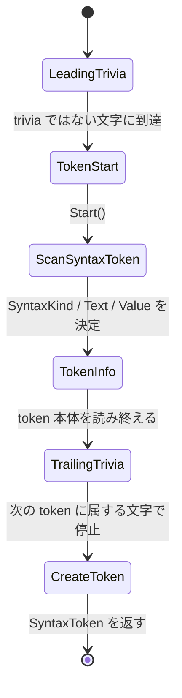

自動販売機の例で言えば、`LeadingTrivia`、`TokenStart`、`ScanSyntaxToken`、`TrailingTrivia` が状態です。  
投入される硬貨の代わりに、入力される文字が `+`、`=`、英字、数字、空白、改行などに変わります。

## ScanSyntaxToken：文字から SyntaxKind を決める

`ScanSyntaxToken` は、Roslyn の lexer を読むうえで特に大事な場所です。  
現在位置の文字を `PeekChar()` で見て、`switch` で分岐し、`info.Kind` に `SyntaxKind` を設定します。

理解用に短くすると、考え方は次のようになります。

```csharp
char ch = PeekChar();

switch (ch)
{
    case '+':
        AdvanceChar();
        kind = TryAdvance('=')
            ? SyntaxKind.PlusEqualsToken
            : TryAdvance('+')
                ? SyntaxKind.PlusPlusToken
                : SyntaxKind.PlusToken;
        break;

    case '=':
        AdvanceChar();
        kind = TryAdvance('=')
            ? SyntaxKind.EqualsEqualsToken
            : TryAdvance('>')
                ? SyntaxKind.EqualsGreaterThanToken
                : SyntaxKind.EqualsToken;
        break;

    case >= '0' and <= '9':
        ScanNumericLiteral();
        break;

    case '_' or (>= 'a' and <= 'z') or (>= 'A' and <= 'Z'):
        ScanIdentifierOrKeyword();
        break;
}
```

このコードの意味は、1 文字だけで token を決めず、必要なら次の文字も見て最長の token を選ぶということです。  
たとえば `+` を見たとき、次が `=` なら `+=`、次が `+` なら `++`、どちらでもなければ `+` です。

この「できるだけ長く読む」という考え方は、字句解析ではよく使われます。

```text
a++ + b
```

この入力を読むと、`+` の並びは次のように分かれます。

| 入力位置 | 読み方 | token |
|---|---|---|
| 🔤 `a` | 識別子として読む | `IdentifierToken` |
| ➕ `++` | 2 文字をまとめて読む | `PlusPlusToken` |
| ➕ `+` | 空白のあと、1 文字の演算子として読む | `PlusToken` |
| 🔤 `b` | 識別子として読む | `IdentifierToken` |

Mermaid で見ると、`+` から始まる小さな DFA は次のように描けます。

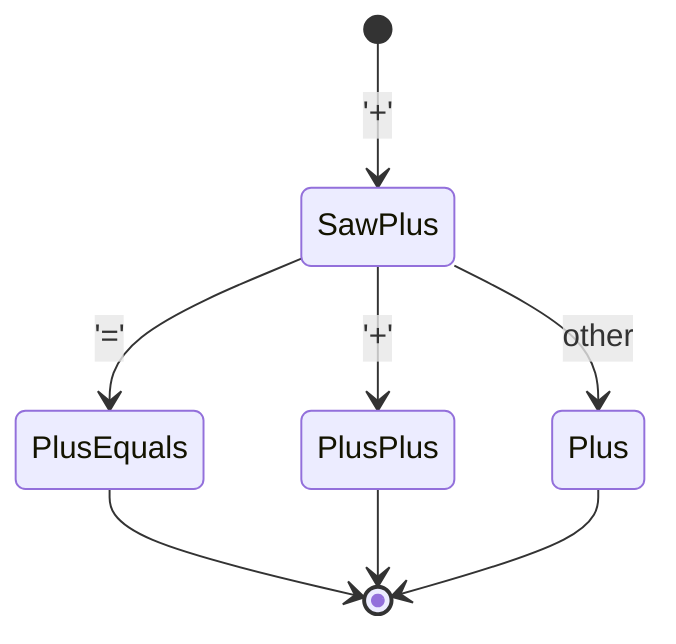

Roslyn の `ScanSyntaxToken` は、このような小さな判定を大量に持っています。  
`=` なら `=`、`==`、`=>` を見分け、英字なら識別子やキーワード候補へ進み、数字なら数値リテラルへ進みます。

Roslyn の実コードにも、たとえば `+` と `=` について次のような分岐があります。

```csharp
case '+':
    TextWindow.AdvanceChar();
    info.Kind =
        TextWindow.TryAdvance('=') ? SyntaxKind.PlusEqualsToken :
        TextWindow.TryAdvance('+') ? SyntaxKind.PlusPlusToken : SyntaxKind.PlusToken;
    break;

case '=':
    TextWindow.AdvanceChar();
    info.Kind =
        TextWindow.TryAdvance('=') ? SyntaxKind.EqualsEqualsToken :
        TextWindow.TryAdvance('>') ? SyntaxKind.EqualsGreaterThanToken : SyntaxKind.EqualsToken;
    break;
```

この断片は、Roslyn の lexer が `TextWindow` という窓から入力文字を見ていることを示しています。  
`AdvanceChar()` は現在の文字を消費する操作です。`TryAdvance('=')` は「次の文字が `=` ならそれも消費して `true` を返す」という操作です。

つまり、`+` を見つけた時点ではまだ token は確定していません。  
次の文字が `=` なら `PlusEqualsToken`、次の文字が `+` なら `PlusPlusToken`、どちらでもなければ `PlusToken` として確定します。これはオートマトンの「次の入力で状態が変わる」という考え方そのものです。

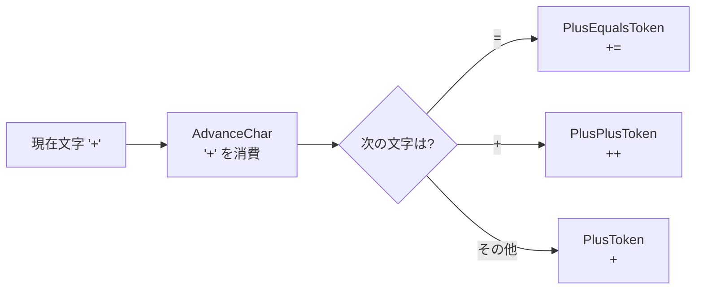

:::message
Roslyn の `ScanIdentifier` には fast path があります。よくある ASCII の識別子を高速に処理し、Unicode 文字や Unicode エスケープなどの複雑なケースでは slow path に進む、という構造です。理論上の状態遷移に、実用上の性能最適化が重なっていると見ると読みやすくなります。
:::

## TokenInfo から SyntaxToken へ：分類結果を API にする

`ScanSyntaxToken` が決めるのは、最終的な公開 API の `SyntaxToken` そのものではありません。  
まず `TokenInfo` に `Kind`、`Text`、`StringValue`、数値の値、contextual keyword の情報などを集めます。その後、`Create` が `SyntaxFactory` を使って token を作ります。

Roslyn の実コードでも、`Create` は `info.Kind` を見て作る token を切り替えています。短く抜き出すと次の形です。

```csharp
switch (info.Kind)
{
    case SyntaxKind.IdentifierToken:
        token = SyntaxFactory.Identifier(info.ContextualKind, leadingNode, info.Text, info.StringValue, trailingNode);
        break;

    case SyntaxKind.NumericLiteralToken:
        token = SyntaxFactory.Literal(leadingNode, info.Text, info.IntValue, trailingNode);
        break;

    case SyntaxKind.EndOfFileToken:
        token = SyntaxFactory.Token(leadingNode, info.Kind, trailingNode);
        break;
}
```

この実コード断片で注目したいのは、`IdentifierToken` と `NumericLiteralToken` で作り方が違うことです。  
識別子は `info.Text` と `info.StringValue` を持ちます。たとえば `@class` のような verbatim identifier では、ソース上の見た目と値としての名前を分けて考える必要があります。

数値リテラルは、`info.Text` だけでは足りません。`40` という文字列を読んだ結果、それが整数値 `40` として扱える、という値情報も token に入ります。  
そのため `SyntaxFactory.Literal(...)` に `info.IntValue` のような値が渡されます。

理解用の疑似コードは次のとおりです。

```csharp
SyntaxToken Create(TokenInfo info, Trivia leading, Trivia trailing)
{
    return info.Kind switch
    {
        SyntaxKind.IdentifierToken =>
            SyntaxFactory.Identifier(info.ContextualKind, leading, info.Text, info.StringValue, trailing),

        SyntaxKind.NumericLiteralToken =>
            SyntaxFactory.Literal(leading, info.Text, info.IntValue, trailing),

        SyntaxKind.StringLiteralToken =>
            SyntaxFactory.Literal(leading, info.Text, info.Kind, info.StringValue, trailing),

        _ =>
            SyntaxFactory.Token(leading, info.Kind, trailing)
    };
}
```

このコードの意味は、「同じ token でも、種類によって必要な情報が違う」ということです。

| token の種類 | 必要な情報 | 例 |
|---|---|---|
| 🏷️ 識別子 | 表面上の文字列、値としての文字列、contextual keyword | `var`, `answer` |
| 🔢 数値リテラル | 表面上の文字列、数値としての値、型の候補 | `40`, `0x10` |
| 🔤 文字列リテラル | 引用符やエスケープを含む文字列、値としての文字列 | `"\\n"` |
| ➕ 記号 token | ほぼ `SyntaxKind` だけで足りる | `+`, `=`, `;` |

`Text` と `ValueText` の違いは、文字列リテラルを見ると分かりやすいです。

```csharp
using Microsoft.CodeAnalysis.CSharp;

var code = """var s = "\n";""";
var root = CSharpSyntaxTree.ParseText(code).GetRoot();

foreach (var token in root.DescendantTokens())
{
    Console.WriteLine($"{token.Kind(),-25} Text={token.Text} ValueText={token.ValueText}");
}
```

このコードは、ソースに書かれた見た目としての `Text` と、値として解釈した `ValueText` を並べて表示します。  
文字列リテラルでは、`Text` は引用符やエスケープを含む表面の文字列、`ValueText` は C# の文字列値として見た中身です。

公開 API 側の `SyntaxToken` では、この違いがプロパティとして見えます。

```csharp
public object? Value => Node?.GetValue();
public string ValueText => Node?.GetValueText() ?? string.Empty;
public string Text => ToString();
```

このコードは、利用者が触る `SyntaxToken` が内部 node を包んだ薄い構造であることを示しています。  
`Text` は「ソースコードにどう書かれていたか」、`Value` や `ValueText` は「コンパイラーが値としてどう読んだか」です。

たとえば `"\\n"` という文字列リテラルでは、`Text` は引用符とバックスラッシュを含む見た目、`ValueText` は改行文字として解釈された値になります。  
この区別があるから、Roslyn の analyzer や code fix は「見た目を保つ」処理と「意味を見る」処理を分けられます。

## Trivia を読む：空白とコメントも構文木に残る

次に、`SyntaxTrivia` を見ます。  
Roslyn では、空白・改行・コメントを単に捨てるのではなく、token の leading trivia または trailing trivia として持ちます。

次のコードを考えます。

```csharp
// answer を計算します
var answer = 40 + 2;
```

Roslyn で leading trivia を表示すると、コメントと改行が `var` の前に付いていることを確認できます。

```csharp
using Microsoft.CodeAnalysis.CSharp;

var code = """
// answer を計算します
var answer = 40 + 2;
""";

var root = CSharpSyntaxTree.ParseText(code).GetRoot();

foreach (var token in root.DescendantTokens())
{
    foreach (var trivia in token.LeadingTrivia)
    {
        Console.WriteLine($"{token.Kind()} has leading {trivia.Kind()} => '{trivia}'");
    }
}
```

このコードは、各 token の前に付いている trivia を列挙します。  
`// answer を計算します` は `SingleLineCommentTrivia`、改行は `EndOfLineTrivia` のように、token とは別の種類として保持されます。

Roslyn の `Lexer.cs` では、trivia の読み取りも具体的な分岐として書かれています。短く見ると次のような形です。

```csharp
case ' ':
case '\t':
    this.AddTrivia(this.ScanWhitespace(), ref triviaList);
    break;

case '/':
    if (TextWindow.PeekChar(1) == '/')
    {
        lexSingleLineComment(ref triviaList);
        break;
    }
    return;
```

この断片では、空白やタブなら `ScanWhitespace()` で `WhitespaceTrivia` として追加します。  
`/` を見たときは、次の文字が `/` なら `//` コメントとして trivia に追加します。次の文字が `/` でなければ、`/` は除算演算子などの token になり得るため、trivia の読み取りを止めます。

この「trivia なら読み続ける、token 本体になりそうなら止まる」というふるまいも、状態遷移として読むことができます。

Mermaid 図で表すと、コメントは token 列から消えるのではなく、次の token に付属します。

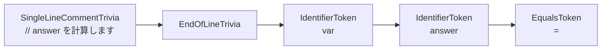

この構造があるため、Roslyn はコード修正やリファクタリングをしても、コメントや空白をできるだけ保ったまま新しい構文木を作れます。

## Roslyn の Lexer を読む練習

最後に、実際に `Lexer.cs` を読むときの手順をまとめます。  
最初から 1 行ずつ読むより、「この入力がどの `SyntaxKind` になるか」を追うほうが理解しやすいです。

題材はこのコードにします。

```csharp
var answer = 40 + 2;
```

読む順番は次のとおりです。

| 手順 | 探す場所 | 見ること |
|---|---|---|
| 1 | `CSharpSyntaxTree.ParseText` | `InternalSyntax.Lexer` と `LanguageParser` が作られる入口 |
| 2 | `Lexer.Lex` | `LexerMode.Syntax` なら通常の C# token を読むこと |
| 3 | `LexSyntaxToken` | leading trivia → token 本体 → trailing trivia → `Create` の順番 |
| 4 | `ScanSyntaxToken` | 先頭文字 `v`, `=`, `4`, `+`, `;` ごとの分岐 |
| 5 | `ScanIdentifierOrKeyword` | `var` と `answer` が識別子・キーワード候補として読まれる流れ |
| 6 | `Create` | `TokenInfo.Kind` から `SyntaxFactory.Identifier` / `Literal` / `Token` が選ばれる流れ |
| 7 | `SyntaxKind.cs` | 出てきた `IdentifierToken`、`EqualsToken`、`NumericLiteralToken` などの定義 |
| 8 | 公開 API の `SyntaxToken.cs` | `Text`、`ValueText`、`Span`、`LeadingTrivia` として見える形 |

この読み方を 1 本の流れにすると、次の図になります。

```mermaid
flowchart TD
    A["入力: var answer = 40 + 2;"] --> B["TextWindow.PeekChar()<br/>現在文字を見る"]
    B --> C{"先頭文字は何か?"}
    C -->|"v / a"| D["ScanIdentifier<br/>IdentifierToken"]
    C -->|"4 / 2"| E["ScanNumericLiteral<br/>NumericLiteralToken"]
    C -->|"="| F["ScanSyntaxToken<br/>EqualsToken"]
    C -->|"+"| G["ScanSyntaxToken<br/>PlusToken"]
    C -->|";"| H["ScanSyntaxToken<br/>SemicolonToken"]
    D --> I["TokenInfo"]
    E --> I
    F --> I
    G --> I
    H --> I
    I --> J["SyntaxFactory<br/>SyntaxToken を作る"]
    J --> K["LanguageParser<br/>構文木に組み込む"]
```

ここまで来ると、Roslyn の `Lexer.cs` は次のように読めます。

```text
1. 現在位置の文字を見る
2. 文字の集合に応じて分岐する
3. 必要なら次の文字も見て、最長の token を選ぶ
4. token の種類を SyntaxKind として記録する
5. 文字列値・数値・trivia・diagnostic を添えて SyntaxToken にする
6. parser が token を受け取り、構文木へ組み立てる
```

これは、前半で見たオートマトンの言葉で言い換えると、次の対応になります。

| オートマトン理論 | Roslyn Lexer での姿 |
|---|---|
| 🤖 状態 | `LexerMode`、`TextWindow.Position`、読み取り中の token 種別 |
| 🔡 入力記号 | 現在位置の `char`、または Unicode エスケープを解釈した文字 |
| 🔁 遷移関数 | `ScanSyntaxToken` や `ScanIdentifier` の分岐 |
| ✅ 受理状態 | `TokenInfo.Kind` が決まり、token の終端に到達した状態 |
| 🏷️ 受理ラベル | `SyntaxKind.IdentifierToken` など |
| 🧾 出力 | `SyntaxFactory` が作る `SyntaxToken` |

:::message
Roslyn を読むときのゴールは、「すべての分岐を暗記すること」ではありません。`入力文字 -> 分岐 -> SyntaxKind -> SyntaxToken -> 構文木` という道筋を追えるようになることです。この道筋が見えると、補間文字列、raw string literal、プリプロセッサ、XML doc comment のような複雑な機能も、同じ入口から読み始められます。
:::

ここまでで、集合から始まった話が Roslyn の `Lexer.cs` を読むための地図までつながりました。最後に全体をまとめます。

## まとめ

この記事では、集合から始めて、オートマトン、字句解析、Roslyn までを 1 本の線として眺めました。  
最後に、対応関係を表で整理します。

| 理論の言葉 | コンパイラーでの姿 | Roslyn で見る場所 |
|---|---|---|
| 🧺 集合 | 数字、英字、空白、記号の分類 | `char` の判定、`Lexer` 内の分岐 |
| 🔁 関係 / 関数 | `(状態, 入力) -> 次の状態` | トークンを読むための状態遷移 |
| 📝 言語 | 受け入れたい文字列の集合 | 識別子、数値、文字列などのトークンパターン |
| 🤖 DFA / NFA | 入力を読み進める有限状態機械 | `ScanSyntaxToken` などの分岐を DFA 的に眺める |
| 🏷️ トークン | 字句解析の出力 | `SyntaxKind.IdentifierToken` など |
| 🌳 構文木 | トークンを構文に組み立てたモデル | `CSharpSyntaxTree.ParseText` と `CompilationUnitSyntax` |

小さなコード例で見ると、全体は次の流れです。

```csharp
var code = "var answer = 40 + 2;";
var tree = CSharpSyntaxTree.ParseText(code);

foreach (var token in tree.GetRoot().DescendantTokens())
{
    Console.WriteLine($"{token.Kind()} => {token.Text}");
}
```

このコードは、ソースコード文字列を Roslyn に渡し、コンパイラーが作る構文モデルの入口であるトークンを取り出しています。  
理論で学んだ集合やオートマトンは、ここでは `token.Kind()` という具体的な API の結果として見えるようになります。

コンパイラーは巨大ですが、入口は「文字を読み、分類し、状態を進める」ことから始まります。  
Roslyn を使うと、その入口をブラックボックスのままにせず、API とソースコードの両方から観察できます。理論と実装の距離が少し近く感じられたらうれしいです😊
