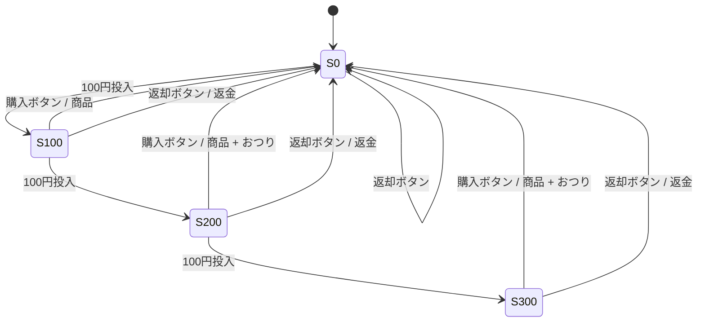
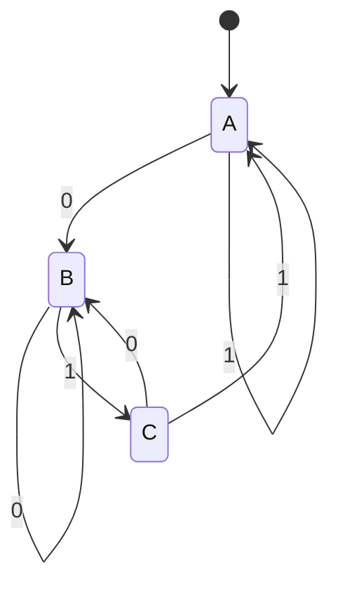

## はじめに 🌟

「オートマトン」や「チューリングマシン」と聞くと、大学の理論科目の名前のように見えて、少し身構えてしまうかもしれません。

ですが私は、これらは**プログラミングから遠い話ではない**と思っています。むしろ、正規表現、字句解析、構文解析、コンパイラといったテーマを理解するための土台として、とても重要です。

本記事では、いきなり厳密な定義から入るのではなく、**高校数学の離散数学に相当する感覚**から出発します。集合、条件分岐、文字列、関数、グラフ、状態遷移といった「有限個のものをルールで扱う」見方を足場にして、オートマトンとチューリングマシンを順に見ていきます。

特に今回は、オートマトンの導入で**自動販売機**の例を使います。状態遷移を直感的に理解しやすく、そのまま「なぜ字句解析ができるのか」に接続しやすいからです。最終的には、**オートマトンが字句解析につながり、その先にコンパイラがある**ところまでを一本の流れとして整理します ✨

## 今回のゴール 🎯

この記事を読み終えると、次のことが分かるようになるはずです。

1. 高校の離散数学っぽい考え方が、計算機科学でどう使われるか
2. オートマトンが「入力を読みながら状態を変える仕組み」だと理解できること
3. 有限オートマトン、プッシュダウンオートマトン、チューリングマシンの役割の違い
4. オートマトンが字句解析にどうつながるか
5. その結果、コンパイラの入り口がどう見えるか

:::message
本記事は初学者向けです。大学の講義のような厳密証明よりも、まず「概念どうしのつながり」をつかむことを重視しています。
:::

## 前提条件 ✅

1. ✅ 高校数学レベルの文章が読めれば大丈夫です
2. ✅ 集合や関数を厳密に覚えていなくても読み進められます
3. ✅ プログラミング経験は少しあれば十分です
4. ✅ コンパイラを作ったことがなくても問題ありません

## なぜ「離散数学」から始めるのか 📘

計算機は、連続的に変化する量よりも、**区切られた記号や状態**を扱うのが得意です。

たとえばソースコードは文字列です。文字列は、`a`、`b`、`+`、`1`、`;` のような**離散的な記号**の並びです。また、プログラムの動作も「この条件ならこちらへ進む」「そうでなければ別の処理をする」といった**有限個の規則**で進みます。

このとき重要になるのが、離散数学の次のような見方です。

| 観点 | 離散数学での見方 | 計算機科学での見方 |
|------|------------------|--------------------|
| 🔤 記号 | 集合の要素 | 文字、トークン |
| ✅ 条件 | 命題の真偽 | if 文、受理条件 |
| 🔁 規則 | 関数 | 状態遷移関数 |
| 🧵 並び | 数列・文字列 | 入力列、ソースコード |
| 🗺️ 関係 | グラフ | 状態遷移図 |

つまり、計算機科学は「高度で難しい数学」だけでできているわけではありません。むしろ、**有限個のものを整理し、規則に従って変化させる**という離散数学の感覚が、そのまま中心にあります。

この感覚が見えると、次に出てくるオートマトンも、特殊な理論というより「記号と状態を扱う自然なモデル」として見えてきます。

## 高校の離散数学と計算機科学の接点 🔗

ここで、いくつかの基本概念を軽くつないでおきます。

### 集合

集合は「要素の集まり」です。オートマトンでは、状態の集まりや入力記号の集まりを集合として考えます。

たとえば入力に使える文字が英小文字だけなら、その入力記号集合は `{a, b, c, ..., z}` です。これを**アルファベット**と呼びます。ここでいうアルファベットは英語学習の意味ではなく、「入力に使える記号全体」の意味です。

### 命題と条件分岐

「この文字列は条件を満たすか」という問いは、最終的には真か偽かで答えられます。これは命題の世界です。

たとえば「この文字列は数字だけでできているか」「この入力は識別子として正しいか」といった問いは、受理するかしないかの二択になります。

### 関数

オートマトンでは、「今の状態」と「読んだ入力」から「次の状態」が決まります。これは関数の考え方そのものです。

たとえば `delta(状態A, 入力0) = 状態B` のように書けます。高校数学で見た「入力を与えると出力が決まる」という構造が、そのまま現れています。

### 文字列

文字列は、記号が順番に並んだものです。プログラムのソースコードも、コンパイラから見れば最初はただの文字列です。

### グラフ

状態と状態を矢印で結ぶと、状態遷移図になります。これはグラフとして見ることができます。つまりグラフの見方は、そのままオートマトンの図に接続します。

このように見ると、オートマトンは突然出てくる不思議な概念ではなく、**離散数学の考え方をそのまま「機械のふるまい」として表したもの**だと分かります。

次に見る自動販売機の例では、集合、関数、グラフ、条件分岐といった離散数学の要素が一度に出てきます。そこを意識して読むと、オートマトンが数学と計算機の橋渡しになっていることが見えやすくなります。

## オートマトンとは何か 🤖

オートマトンは、ひとことで言えば、**入力を 1 つずつ読みながら状態を変えていく仕組み**です。

大事な要素は次の 5 つです。

1. 現在どこにいるかを表す **状態**
2. 外から入ってくる **入力**
3. 入力に応じて状態を変える **遷移**
4. 最初にいる **開始状態**
5. 条件を満たしたとみなす **受理状態**

この説明だけだと抽象的なので、まずは日常的な例で直感を作りましょう。初心者向けの導入としては、自動販売機がとても分かりやすいです。

## 自動販売機で理解する状態遷移 🥤

100 円のジュースを売っている自動販売機を考えてみます。投入できる硬貨は 100 円玉だけだとしましょう。

このとき、自動販売機はたとえば次のような状態を持つと考えられます。

1. `S0`: 0 円の状態
2. `S100`: 100 円入っている状態
3. `S200`: 200 円入っている状態
4. `S300+`: 300 円以上入っている状態

そして、入力は次のようなものです。

1. `100円投入`
2. `購入ボタン`
3. `返却ボタン`

重要なのは、自動販売機が**過去の全履歴を丸ごと覚えている必要はない**という点です。必要なのは「今いくら入っている状態か」です。

たとえば、

1. `S0` で `100円投入` → `S100`
2. `S100` で `100円投入` → `S200`
3. `S100` で `購入ボタン` → 商品を出して `S0`
4. `S0` で `購入ボタン` → 何も出ず `S0`

というふるまいになります。



この見方がオートマトンの核心です。つまり、**入力を読むたびに、有限個の状態のどれかへ移る**のです。

自動販売機の例では、内部で複雑な計算をしているように見えても、観察者から見える本質は「状態遷移」です。ここが分かると、コンピュータが文字列を読むときのふるまいも似たものだと見えてきます。

対応づけるなら、硬貨やボタンは**入力記号**、投入金額は**状態**、商品を出せるかどうかは**受理判定**に相当します。つまり自動販売機は、日常の中にあるオートマトンの例として見ることができます。

## 有限オートマトンを文字列判定の機械として見る 🔠

自販機の例では入力はボタンや硬貨でしたが、計算機科学では入力は通常**文字列**です。

たとえば、`0` と `1` からなる文字列が、**末尾が `01` で終わるか**を判定したいとします。対象となる文字列は次のようなものです。

1. `01` → 受理
2. `101` → 受理
3. `1101` → 受理
4. `10` → 不受理
5. `111` → 不受理

このとき必要なのは、入力全体を保存することではありません。大事なのは「今見た末尾がどの形になっているか」です。

たとえば次のような状態を考えられます。

1. `A`: まだ `01` の候補になっていない状態
2. `B`: 直前が `0` である状態
3. `C`: 直前 2 文字が `01` である状態

状態遷移図で書くと、次のように表せます。



受理状態は `C` です。つまり、入力を最後まで読んだ時点で `C` にいれば、その文字列は「末尾が `01` で終わる」と判定できます。

このとき遷移表は次のように書けます。

| 現在の状態 | 入力 `0` | 入力 `1` | 意味 |
|------------|----------|----------|------|
| `A` | `B` | `A` | まだ `01` に近づいていない |
| `B` | `B` | `C` | 直前が `0` |
| `C` | `B` | `A` | 直前 2 文字が `01` |

このように、有限オートマトンは**文字列を左から右へ読み、最後にどの状態へ到達したかで判定する機械**だと捉えられます。

## 有限オートマトンを少しだけ形式的に見る

有限オートマトンは、しばしば次の 5 つ組で表します。

```text
(Q, Σ, δ, q0, F)
```

それぞれの意味は次のとおりです。

1. `Q`: 状態の集合
2. `Σ`: 入力記号の集合
3. `δ`: 遷移関数
4. `q0`: 開始状態
5. `F`: 受理状態の集合

末尾が `01` で終わるかを判定する例なら、たとえば次のように書けます。

```text
Q  = {A, B, C}
Σ  = {0, 1}
q0 = A
F  = {C}
```

遷移関数 `δ` は、たとえば `δ(B, 1) = C` のように定義されます。意味は「状態 `B` で入力 `1` を読んだら状態 `C` へ移る」です。

最初は記号が多く見えるかもしれませんが、やっていることは自販機と同じです。**状態の一覧、入力の種類、次にどこへ行くかのルール、スタート地点、受理判定**をまとめているだけです。

## DFA と NFA は何が違うのか

有限オートマトンには、代表的に次の 2 種類があります。

| 種類 | 日本語 | 特徴 |
|------|--------|------|
| DFA | 決定性有限オートマトン | 各状態で各入力に対する次状態が 1 つに決まる |
| NFA | 非決定性有限オートマトン | 同じ入力で複数の遷移候補を持てる |

初心者向けには、まず DFA を理解するのがよいです。理由はシンプルで、**「今の状態」と「次の文字」が決まれば、次にどこへ行くかが 1 つに決まる**からです。

一方の NFA は、1 つの入力に対して複数の可能性を同時に考えてよいモデルです。直感的には少し不思議ですが、実は表現力が増えるわけではありません。**NFA で表せる言語は、DFA でも表せます。**

この事実は、正規表現を実装に落とすときに重要です。人間にとっては正規表現で書きやすく、機械に実行させるときは DFA に変換して使う、という流れがよく現れます。

## 正規表現と有限オートマトン ✨

プログラミングをしていると、正規表現に触れることがあります。たとえば「数字が 1 回以上続く」「英字で始まり、その後に英数字や `_` が続く」といったパターンを書くときです。

たとえば、識別子の簡略化したルールを次のように考えます。

1. 先頭は英字または `_`
2. 2 文字目以降は英字、数字、`_`

これは正規表現でおおよそ次のように書けます。

```text
[A-Za-z_][A-Za-z0-9_]*
```

ここで重要なのは、**正規表現は「許される文字列の形」を書く方法であり、有限オートマトンはそれを機械として実行する方法**だということです。

つまり、

1. 正規表現は「どんな文字列を許すか」を記述する
2. 有限オートマトンは「その文字列をどう読むか」を表す

という関係です。

この対応は、検索機能だけではなく、後で見る**字句解析器（lexer）**にもそのまま現れます。

## 有限オートマトンでできること・できないこと ⚖️

有限オートマトンは便利ですが、万能ではありません。

比較的得意なのは、次のようなものです。

1. 整数リテラル
2. 識別子
3. 空白文字の連続
4. `+`, `-`, `*`, `/` のような演算子
5. `if`, `while`, `return` のような予約語

一方で、次のような問題は苦手です。

1. かっこが正しく対応しているか
2. `a^n b^n` のように個数を対応させる必要があるもの
3. 入れ子構造の深さを覚える必要があるもの

なぜ苦手かというと、有限オートマトンは**状態数が有限**だからです。

たとえば、かっこの深さが 1 なのか 2 なのか 100 なのかを完全に追いかけたいとします。すると本質的には、深さごとに区別できるだけの記憶が必要です。しかし有限オートマトンは、有限個の状態しか持てません。

ここはもう少し論理的に見ると分かりやすいです。仮に、ある有限オートマトンが「開きかっこと閉じかっこが正しく対応している文字列」をすべて判定できるとします。

ところが、そのオートマトンの状態数が有限なら、十分に長い開きかっこの列

```text
((((((((...
```

を読んでいく途中で、どこかの 2 箇所では**同じ状態に戻ってしまう**はずです。これは、箱の数より多くの玉を入れればどこかの箱に 2 個以上入る、という鳩の巣原理と同じ感覚です。

もし深さ 5 の時点と深さ 8 の時点で同じ状態になってしまうなら、その機械にとっては「今どちらの深さにいるか」を区別できていません。すると、その後に閉じかっこを 5 個読む場合と 8 個読む場合のふるまいを本質的に分けられません。

つまり有限オートマトンは、

1. 「いま何文字目まで読んだか」
2. 「開きかっこがいま何個たまっているか」
3. 「`a` を何個読んだので、これから `b` を何個読むべきか」

といった**任意に大きくなりうる個数**を保持できません。

`a^n b^n` が有限オートマトンで扱えないのも同じ理由です。`aaaa` を読んだ時点で「あとで `b` が 4 個必要」と覚えたいのですが、`n` に上限がない以上、有限個の状態だけでは足りません。ここで必要なのは、「数えたぶんだけ何かを積んでおく」仕組みです。

:::message alert
「有限オートマトンは何でもできる」と思ってしまうと、正規表現だけでプログラム全体を完全に解析できるように感じてしまいます。実際には、入れ子構造や対応関係を正確に扱うには、もう少し強いモデルが必要です。
:::

ここで登場するのが、**プッシュダウンオートマトン**です。

## プッシュダウンオートマトンに少し触れる 📚

プッシュダウンオートマトンは、有限オートマトンに**スタック**を追加したものです。

スタックは「後入れ先出し」のデータ構造です。たとえば `(` を読んだら積み、`)` を読んだら取り出す、ということができます。これにより、かっこの対応やある程度の入れ子構造を扱えるようになります。

有限オートマトンとの違いは、単に「記憶が少し増えた」というだけではありません。プッシュダウンオートマトンでは、遷移が

1. **現在の状態**
2. **今読んでいる入力記号**
3. **スタックの先頭にある記号**

の 3 つで決まります。

そして遷移の結果として、

1. 次の状態へ移る
2. スタック先頭を取り除く（pop）
3. 新しい記号を積む（push）
4. 入力を読まずに内部遷移する（`ε` 遷移）

といった操作ができます。

有限オートマトンの遷移関数が「状態 × 入力 → 次状態」だったのに対し、プッシュダウンオートマトンは直感的には「状態 × 入力 × スタック先頭 → 次状態 + スタック更新」になっています。ここが論理構造の本質です。

形式的には、プッシュダウンオートマトンはしばしば次のような 7 つ組で表されます。

```text
(Q, Σ, Γ, δ, q0, Z0, F)
```

意味は次のとおりです。

1. `Q`: 状態の集合
2. `Σ`: 入力記号の集合
3. `Γ`: スタック記号の集合
4. `δ`: 遷移関数
5. `q0`: 開始状態
6. `Z0`: スタックの初期記号
7. `F`: 受理状態の集合

ここで新しく出てくる `Γ` と `Z0` が、有限オートマトンにはなかった部分です。つまり PDA は、**入力を読む機械**であると同時に、**スタックを書き換える機械**でもあります。

たとえば、かっこ列を読む単純化した PDA なら、次のような規則を持てます。

1. `(` を読んだら、スタックに `(` を積む
2. `)` を読んだら、スタック先頭の `(` を 1 つ取り出す
3. 途中で `)` を読みたいのにスタックが空なら不正
4. すべて読み終えたとき、スタックが初期記号だけに戻っていれば受理

これを図式化すると、PDA は「読んだ開きかっこの数だけスタックに印を積み、閉じかっこが来たら 1 個ずつ消していく」機械です。つまり、**有限オートマトンが苦手だった“未処理の対応待ち情報”を、スタックに逃がせる**わけです。

`a^n b^n` のような言語でも同じ発想が使えます。

1. `a` を読むたびにスタックへ `A` を積む
2. `b` を読む段階に入ったら、`b` 1 つにつき `A` を 1 つ取り出す
3. 入力が終わったときにスタックがちょうど空なら、`a` と `b` の個数が一致している

ここで重要なのは、PDA が「無限に長い入力を何でも扱える」わけではなく、**1 本のスタックで表現できる種類の依存関係に強い**という点です。だからこそ、かっこの対応や木構造のような**文脈自由言語**に自然に対応します。

たとえば次のようなコードを考えてみます。

```c
if (x > 0) {
    while (y < 10) {
        y = y + 1;
    }
}
```

このコードは、単なる文字の並びではありません。`if` ブロックの中に `while` ブロックが入り、その中に文があります。つまり、**木のような構造**を持っています。

こうした構造は、有限オートマトンだけでは扱いにくく、スタックの考え方が必要になります。このため、コンパイラでも

1. 文字の切り出しには有限オートマトン
2. 構造の読み取りにはスタックや文法

という分担が生まれます。

この橋渡しを理解しておくと、後で「なぜ lexer と parser が分かれているのか」が自然に見えてきます。

別の言い方をすると、lexer が見ているのは「この文字列片は識別子か、数値か、演算子か」という**平面的な分類**です。一方 parser が見ているのは、「この `)` はどの `(` に対応するのか」「この `else` はどの `if` にぶら下がるのか」といった**階層的な対応関係**です。ここに、有限オートマトンとプッシュダウンオートマトンの違いがそのまま表れています。

## チューリングマシンとは何か 🧠

チューリングマシンは、**計算可能性**を考えるときの代表的なモデルです。

有限オートマトンとの大きな違いは、次の 2 点です。

1. **読むだけでなく書ける**
2. **非常に長いテープを作業領域として使える**

典型的なチューリングマシンは、次の要素を持ちます。

1. 記号が並んだテープ
2. テープ上の 1 マスを読んでいるヘッド
3. 現在の状態
4. 「読んだ記号に応じて、何を書き、どちらへ動き、次にどの状態へ行くか」という規則

有限オートマトンは、入力を左から右へ読むだけでした。しかしチューリングマシンは、必要なら記号を書き換え、左へ戻り、途中結果を保持しながら処理できます。

この違いは本質的です。有限オートマトンが「パターンを見分ける機械」の色合いが強いのに対し、チューリングマシンは**一般的な計算手順そのものを表せる機械**と見なされます。

### チューリングマシンの構成をもう少し具体的に見る

有限オートマトンとの違いが見えやすいように、比較してみます。

| モデル | 主な記憶 | 主な目的 | 典型的なイメージ |
|------|----------|----------|------------------|
| 🤖 有限オートマトン | 有限個の状態 | パターン認識 | 文字列が条件を満たすか判定する |
| 📚 プッシュダウンオートマトン | 状態 + スタック | 入れ子構造の認識 | かっこの対応や構文解析 |
| 🧠 チューリングマシン | 状態 + 読み書き可能なテープ | 一般的な計算 | 途中結果を書き込みながら処理する |

チューリングマシンでは、テープは入力の置き場所であると同時に、作業メモの置き場でもあります。ここが重要です。

人間が筆算をするときも、途中結果を書きます。頭の中だけではなく、紙にメモしながら進めます。チューリングマシンも、考え方としてはそれに近いです。**読んで、書いて、動いて、また読む**の繰り返しで計算を進めます。

### チューリングマシンを具体的にイメージする 🔍

たとえば、単項表現で `111` を `1111` にする処理を考えます。ここでは `1` が 1 個で「1」を表し、`111` は「3」を表しているとします。

チューリングマシンは、右へ右へと進みながら `1` を読み、空白にぶつかったらそこへ `1` を書き込めば、`1111` を得られます。

流れとしては次のようなイメージです。

1. ヘッドが最初の `1` を読む
2. 右へ進む
3. 次の `1` を読む
4. また右へ進む
5. 空白を見つけたら `1` を書く
6. 停止する

図にすると、雰囲気は次のようになります。

```text
初期: [1][1][1][ ]   ヘッドは左端
移動: [1][1][1][ ]   右へ進む
移動: [1][1][1][ ]   右へ進む
書込: [1][1][1][1]   空白に 1 を書く
停止
```

これだけ見ると単純ですが、重要なのは、**読み・書き・移動**の組み合わせで計算を組み立てられるという点です。

加算、減算、比較、コピー、探索といった操作も、このような小さな規則の組み合わせで表現できます。だからこそチューリングマシンは、コンピュータで実現できる計算を考えるための基本モデルになります。

## チューリングマシンが重要な理由

チューリングマシンが有名なのは、「昔の単純な理論モデルだから」ではありません。重要なのは、**何が計算できて、何が計算できないのか**を考えるための基準になるからです。

たとえば、ある問題について

1. そもそもアルゴリズムで解けるのか
2. 解けるとして、どれくらいの資源が必要か
3. ある種の万能な判定器が存在するのか

といった問いを立てるとき、チューリングマシンが土台になります。

代表的な話として、**停止性問題**があります。これは「任意のプログラムと入力に対して、そのプログラムが停止するかどうかを常に正しく判定する万能な方法はあるか」という問いです。答えは「ない」です。

この話は少し重いですが、大切なのは「コンピュータには限界がある」という見方です。チューリングマシンは、ただ強力なだけではなく、**計算の限界を考えるための道具**でもあります。

ここで一度整理すると、**字句解析で直接活躍するのは有限オートマトン**であり、**構文解析ではスタックを持つモデルの発想**が効き、**チューリングマシンはそれらを含むより一般的な計算の土台**を与えます。つまり、チューリングマシンは lexer をそのまま実装するための道具というより、「計算全体をどこまで一般化できるか」を考えるための上位の視点です。

## オートマトンから字句解析へ 🔍

ここで、ようやくコンパイラの実務的な話に接続できます。

ソースコードは、まず文字列です。たとえば次のようなコードを考えます。

```text
total = price + 100;
```

コンパイラは最初から「これは代入文だ」と理解しているわけではありません。まずは文字を左から右へ読みながら、次のような単位に分けます。

```text
IDENT(total)
ASSIGN(=)
IDENT(price)
PLUS(+)
NUMBER(100)
SEMICOLON(;)
```

この処理が**字句解析**です。

字句解析の役割は、文字の流れを、意味のある最小単位である**トークン**に分解することです。ここで有限オートマトンの考え方がそのまま使えます。

たとえば、字句解析器は内部で次のような状態を持てます。

1. `Start`: まだ何も読んでいない
2. `InIdentifier`: 識別子を読んでいる
3. `InNumber`: 数字列を読んでいる
4. `InWhitespace`: 空白を読み飛ばしている
5. `InOperator`: 演算子を読んでいる

そして、

1. `t` を読めば `InIdentifier` に入る
2. 次の `o`, `t`, `a`, `l` を読んでいる間はその状態を維持する
3. 空白や `=` が来たら識別子トークンを確定する
4. `=` を読んだら代入演算子トークンを確定する

という流れになります。

これは、自動販売機の例と本質的には同じです。自販機が「今いくら入っているか」で判断したように、lexer は「今どんな種類のトークンを読んでいる途中か」で判断します。

つまり、**いまの状態と次の入力文字だけを見て、次のふるまいを決める**のです。ここがつながると、オートマトンは急に身近になります。

## 字句解析で有限オートマトンが活躍する具体例

字句解析で有限オートマトンが向いている理由は、トークンの多くが**局所的なパターン**だからです。

たとえば、簡略化した規則なら次のように表せます。

| トークン種別 | 例 | おおよその正規表現 |
|--------------|----|--------------------|
| 🔤 識別子 | `total`, `_count` | `[A-Za-z_][A-Za-z0-9_]*` |
| 🔢 数値 | `0`, `100`, `42` | `[0-9]+` |
| ⚪ 空白 | ` `, `\t`, 改行 | `[ \t\r\n]+` |
| ➕ 演算子 | `+`, `-`, `*`, `/` | `[+\-*/]` |
| 🧷 区切り記号 | `;`, `,`, `(`, `)` | `[;,()]` |

これらは「今読んでいる文字がどのクラスに属するか」を見ながら、有限個の状態を行き来するだけで識別できます。

たとえば `price123` は、最初の `p` を読んだ時点で「これは識別子っぽい」と分かり、その後に英字や数字が続く限り同じ状態にいればよいです。一方で `123price` は、最初は数値状態に入り、その後に英字が出た時点でルール違反として扱うか、別のトークンに切り分けるかを決めます。

このように、lexer の役割は「構造を理解する」前に、「文字の流れを分類する」ことです。そして分類は、有限オートマトンがもっとも得意な仕事のひとつです。

## 字句解析からコンパイラ全体へ 🏗️

コンパイラ全体の流れをざっくり描くと、次のようになります。


ここで重要なのは、それぞれの段階が別の役割を持っていることです。

### 字句解析

文字列をトークン列に変えます。ここでは有限オートマトンの発想がとても有効です。

### 構文解析

トークン列が文法に従っているかを調べ、構文木を作ります。ここでは入れ子構造を扱う必要があるので、スタックの世界、つまりプッシュダウンオートマトンに近い発想が重要になります。

### 意味解析

変数が宣言されているか、型が合っているか、関数呼び出しが正しいかなどを調べます。これはもう、単なる文字パターンではなく、プログラム全体の意味の世界です。

### 最適化とコード生成

より効率のよい形に変換し、最終的な機械語や中間表現へ落とし込みます。ここまで来ると、有限オートマトンだけでは足りず、より一般的なアルゴリズムの世界になります。

つまり、コンパイラは単一の理論だけでできているわけではありません。

1. 🔤 文字を切り出すところでは有限オートマトン
2. 🌲 構造を読むところではスタックと文法
3. 🧠 計算全体の可能性を考えるところではチューリングマシン的な一般計算モデル

というように、複数のモデルの上に成り立っています。

この対応関係を先に地図として持っておくと、有限オートマトンからプッシュダウンオートマトン、そしてチューリングマシンへと話が広がった理由も見えやすくなります。**lexer = 有限オートマトン、parser = PDA 的発想、計算可能性の土台 = TM** と整理しておくと、学ぶ対象どうしが混線しにくくなります。

## なぜ「オートマトンが分かるとコンパイラが見えてくる」のか

コンパイラは巨大で難しそうに見えますが、最初から全部を理解する必要はありません。

大切なのは、**入り口がどこか**を知ることです。その入り口が字句解析です。

そして字句解析は、有限オートマトンの考え方でかなり説明できます。つまり、

1. 状態がある
2. 入力文字を 1 つずつ読む
3. 条件に応じて遷移する
4. トークンが完成したら確定する

という流れです。

この見方が身につくと、「コンパイラは謎の黒箱ではなく、段階ごとの役割を持つ部品の集まり」だと見えてきます。ここが計算機科学の面白いところです。

## 有限オートマトンとチューリングマシンをどう捉えればよいか 🎓

初心者のうちは、次のように整理すると分かりやすいと思います。

1. 有限オートマトンは、**限られた記憶でパターンを見分ける機械**
2. プッシュダウンオートマトンは、**入れ子構造を扱える機械**
3. チューリングマシンは、**一般的な計算手順を表せる機械**

そして実務との対応は、次のように見ると納得しやすいです。

| 実務の対象 | 背後にある考え方 |
|------|----------------|
| 🔎 正規表現 | 有限オートマトン |
| 🧾 字句解析器 | 有限オートマトン |
| 🌲 構文解析器 | 文法 + スタック |
| 💻 一般的な計算 | チューリングマシン的な計算モデル |

この整理を持っておくと、次のような疑問に答えやすくなります。

1. なぜ正規表現だけではプログラム全体の構造を扱えないのか
2. なぜ lexer と parser は別の役割として分かれているのか
3. なぜ計算機科学では「何ができるか」だけでなく「何ができないか」も大切なのか

## おわりに 📝

本記事では、高校の離散数学に近い感覚から出発して、オートマトン、チューリングマシン、そしてコンパイラまでをつなげて見てきました。

振り返ると、流れは次のようになります。

1. 離散数学は、集合・条件・文字列・関数・グラフを扱う
2. その感覚を機械にしたものがオートマトンである
3. 自販機のように、オートマトンは「状態」を持って入力に応じて動く
4. 有限オートマトンは文字列パターンの認識に強い
5. そのため、字句解析の考え方につながる
6. ただし入れ子構造には弱く、構文解析ではスタックや文法が重要になる
7. さらに一般的な計算を考えると、チューリングマシンが基礎モデルになる

私は、計算機科学の面白さは、この**理論と実装がつながる瞬間**にあると感じています。オートマトンは抽象的な概念ですが、字句解析やコンパイラと結びついた途端に、急に輪郭がはっきりしてきます。

次に学ぶなら、以下の順番がおすすめです。

1. 正規表現と DFA / NFA の関係
2. 文脈自由文法
3. 再帰下降構文解析
4. 抽象構文木（AST）
5. 簡単なインタプリタや電卓 parser の実装

ここまで進むと、「プログラミング言語はどう読まれ、どう理解されるのか」がかなり具体的に見えてきます。コンパイラが少しでも身近に感じられたなら、とてもうれしいです ✨
