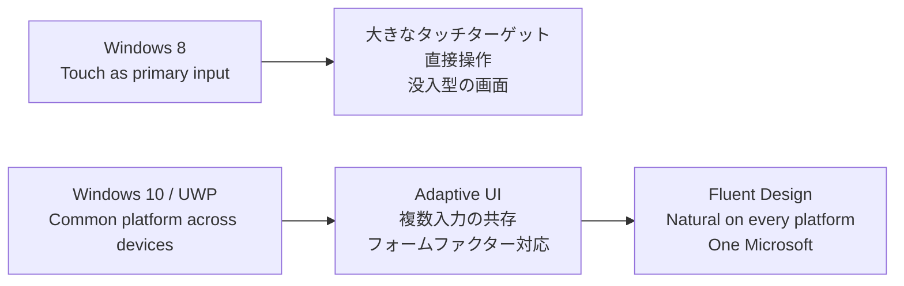

## はじめに 🌟

Windows の UI は、単なる見た目の流行ではなく、その時代に Microsoft が **何を優先して OS を設計していたか** を映す鏡だと私は考えています。

Windows 8 を触ったとき、多くの人が最初に感じたのは「ずいぶんタッチ寄りになったな」という違和感だったのではないでしょうか。全画面を前提にしたスタート画面、大きなタイル、スワイプを前提にした操作体系は、従来のデスクトップ中心の Windows とかなり違って見えました。

一方で Windows 10 以降は、デスクトップを取り戻しながらも、Fluent Design によって「Windows らしい一貫した体験」を再構築していきます。ここには、単なる見た目の刷新ではなく、**多様なデバイス・入力・文脈をまたぐ体験設計** への重心移動が見えます。

この記事では、Microsoft の一次情報をたどりながら、**Windows 8 は touch-first の時代の UI**、**Windows 10 + Fluent は cross-device の時代の UI** と読めるのではないか、という観点から考えてみます ✨

:::message
本記事は事実と解釈を分けて書いています。  
Windows 8 が **touch-first** だったことは Microsoft の一次情報で確認できます。一方で、Windows 10 の UI そのものが **cloud-first** だと Microsoft が明言しているわけではありません。そこは Satya Nadella 氏の戦略方針と Windows 10 / Fluent の設計を読み合わせた、私の解釈です。
:::

## 今回のゴール 🎯

- ✅ Windows 8 と Windows 10 の UI を「見た目」ではなく「設計思想の表現」として読む
- ✅ 一次情報に基づいて、事実と解釈の境界を明確にする
- ✅ Web やアプリ設計にも応用できる視点を整理する

## まず結論から 📝

先に私の結論を書くと、次のように整理できます。

| 観点 | Windows 8 | Windows 10 + Fluent |
|------|-----------|---------------------|
| 🖐️ 主入力の前提 | タッチを主要入力として前面に置く | キーボード / マウス / タッチ / ペンなどの併存 |
| 📱 想定する姿勢 | タブレット的で没入的な体験 | 複数デバイス・複数フォームファクターの連続性 |
| 🧭 UI の役割 | 直接操作しやすいことを前面に出す | デバイス差をまたいでも自然で一貫した体験をつくる |
| 🏗️ OS / プラットフォームの重心 | タッチ時代への最適化 | 共通プラットフォームと適応的 UI |
| ☁️ クラウドとの関係 | UI には前面化しにくい | UI 自体よりも「つながる体験」を支える背景思想として見える |

つまり、Windows 8 は **入力の転換点**、Windows 10 は **体験の連続性への転換点** と見ると理解しやすいです。

## Windows 8 の UI は「触れること」を最優先した

Windows 8 期の Microsoft ドキュメントには、かなりはっきりした言い方があります。

> Design your apps with touch interactions in mind. Touch input is supported by an increasingly large and varied number of devices, and touch interactions are a fundamental aspect of the Windows experience.  
> Because touch is a primary mode of interaction for users of Windows and Windows Phone, the platforms are optimized for touch input to make your apps responsive, accurate, and easy to use.  
> — [Responding to user interaction (HTML)](https://learn.microsoft.com/en-us/previous-versions/windows/apps/hh700412(v=win.10)?WT.mc_id=DT-MVP-5004827)

さらに同じページでは、組み込みコントロールについて次のように説明されています。

> The built-in controls are designed from the ground up to be touch-optimized...  
> When you couple these with direct manipulations, such as pan, zoom, rotate, drag, and realistic inertia behavior, they enable a compelling and immersive interaction experience...  
> — [Responding to user interaction (HTML)](https://learn.microsoft.com/en-us/previous-versions/windows/apps/hh700412(v=win.10)?WT.mc_id=DT-MVP-5004827)

ここから読めるのは、Windows 8 において UI はまず **指で直接触れて操作できること** を中心に据えられていた、ということです。

私はこの設計思想が、次のような UI に現れていたと考えています。

- 🟦 **大きなタイル**: 指で狙いやすい
- ↔️ **スワイプ前提の操作**: 直接操作と相性が良い
- 🪟 **全画面寄りのアプリ体験**: 対象に集中しやすい
- 🧼 **装飾よりコンテンツ優先**: タッチ操作の邪魔を減らす

つまり Windows 8 の UI は、デスクトップをそのままタブレットに持ち込んだのではなく、**「これからは触ることが主要入力になる」** という前提から逆算して再設計されたように見えます。

:::message
「Metro UI」という呼び方は通称として使われることがありますが、本記事では呼称そのものよりも、**touch-first な設計思想** に注目しています。
:::

## Windows 10 と Fluent は「どこでも同じように使える」を目指した

Windows 10 では、Windows 8 のようにタッチを前面に出すというより、**複数入力が併存する前提** がよりはっきり見えるようになります。しかし、これは後退というより、**対象デバイスの多様化に対応するための再調整** だったと私は見ています。

Microsoft Learn の UWP ガイドには、Windows 10 の方向性がよく表れています。

> Windows 10 introduced the Universal Windows Platform (UWP), which provides a common app platform on every device that runs Windows.  
> — [Universal Windows Platform guide](https://learn.microsoft.com/en-us/windows/uwp/get-started/universal-application-platform-guide?WT.mc_id=DT-MVP-5004827)

さらに同じページでは、こう続きます。

> UI elements respond to the size and DPI of the screen the app is running on by adjusting their layout and scale. UWP apps work well with multiple types of input such as keyboard, mouse, touch, pen, and game controllers.  
> — [Universal Windows Platform guide](https://learn.microsoft.com/en-us/windows/uwp/get-started/universal-application-platform-guide?WT.mc_id=DT-MVP-5004827)

そして Fluent Design については、次の説明が非常に示唆的です。

> The Fluent Design System is a set of UWP features combined with best practices for creating apps that perform beautifully on all types of Windows-powered devices. Fluent experiences adapt and feel natural on devices from tablets to laptops, from PCs to televisions, and on virtual reality devices.  
> — [Universal Windows Platform guide](https://learn.microsoft.com/en-us/windows/uwp/get-started/universal-application-platform-guide?WT.mc_id=DT-MVP-5004827)

また、現在の Windows デザインガイドでも次のように整理されています。

> ...craft consistent interfaces that work seamlessly across devices, input types, and form factors.  
> — [Design Windows apps](https://learn.microsoft.com/en-us/windows/apps/design/?WT.mc_id=DT-MVP-5004827)

さらに、現行の Fluent 2 の原則を見ても、同じ志向が続いていることが分かります。

> Natural on every platform  
> Your experiences should adapt to the device you're on...  
> — [Fluent 2 Design principles](https://fluent2.microsoft.design/design-principles)

ここから見えてくるのは、Windows 10 / Fluent の中心課題が「タッチか否か」ではなく、**どのデバイスでも自然につながる体験をどう設計するか** に移っていることです。

### Windows 8 と Windows 10 の違いを図にすると

この流れで見ると、Windows 10 の UI は「タッチのための UI」ではなく、**多様な利用姿勢のための UI** になっています。

ここまでは、比較的に一次情報から確認しやすい事実ベースの比較です。次に、この比較を **どこまで事実として言えて、どこからが解釈なのか** を切り分けます。

## では「クラウドファースト」はどこに現れるのか ☁️

ここからは、事実そのものではなく **解釈レイヤー** の話です。ここは本記事のいちばん大事な注意点でもあります。

Satya Nadella 氏は 2014 年の公式スピーチで、Microsoft の戦略を次のように表現しています。

> ...I talked about this in my first mail to all Microsoft employees as a mobile-first, cloud-first world.  
> ...a device which is not connected to the cloud just cannot complete the scenarios.  
> ...we think about users, both individuals and organizations, spanning across all devices.  
> — [Satya Nadella: Mobile First, Cloud First Press Briefing](https://news.microsoft.com/speeches/satya-nadella-mobile-first-cloud-first/)

この発言は非常に重要です。ただし、ここからすぐに **「だから Windows 10 の UI は cloud-first である」** と断定するのは危険です。

Microsoft が一次情報で明言しているのは、あくまで次の 3 点です。

| 項目 | 一次情報ベースの判断 |
|------|----------------------|
| ✅ Windows 8 は touch-first だった | 明確に言える |
| ✅ Windows 10 / Fluent は cross-device で adaptive な体験を重視した | 明確に言える |
| ⚠️ Windows 10 の UI そのものが cloud-first だった | 明言は見つからない |

:::message alert
**「Windows 10 の UI は cloud-first だった」は、Microsoft の明示的な表現ではありません。**  
安全に書くなら、**「Nadella 氏の mobile-first / cloud-first 戦略の時代に、Windows 10 と Fluent は複数デバイスをまたぐ一貫した体験を重視した」** と表現するのがよいです。
:::

私の解釈では、クラウドファーストという性格は Acrylic や Reveal のような見た目そのものより、むしろ **「UI がサービスとつながる継続的な体験の入口になること」** に現れています。

たとえば、Windows 10 時代の Microsoft は次のような方向に進みました。

- 🌐 **デバイスをまたいで共通のアプリ基盤を持つ**
- 🔄 **入力方法が変わっても体験が破綻しない**
- 👤 **ユーザーが複数デバイスにまたがって作業することを前提にする**
- ☁️ **クラウド接続を含むアプリ体験の継続性を重視する**

この意味では、Windows 10 / Fluent を **cloud-first な企業戦略と整合する体験設計** と読めます。ただし、それは「Microsoft がそう名付けた」ではなく、「そう読むと筋が通る」というレベルです。

## UI デザインは OS の思想をどう可視化するのか

ここまでを踏まえると、Windows の UI デザインは次のように読めます。

### Windows 8

Windows 8 の UI は、**新しい入力様式に OS 全体を最適化する** という思想の可視化です。  
つまり、「PC をどう見せるか」よりも、「これからの計算機をどう触るか」が優先されていました。

### Windows 10 + Fluent

Windows 10 / Fluent の UI は、**複数デバイス・複数入力・複数文脈を横断して体験を一貫させる** という思想の可視化です。  
つまり、「どの画面が未来っぽいか」よりも、「どこで使っても Windows として自然に感じられるか」が重要になっています。

この違いを一言でまとめるなら、私は次のように表現したいです。

| 時代 | UI が解こうとしていた中心課題 |
|------|------------------------------|
| 🟦 Windows 8 | **触りやすさ** を OS レベルで成立させる |
| ✨ Windows 10 + Fluent | **つながりやすさ** を OS / プラットフォーム全体で成立させる |

## 開発者にとっての示唆 💡

この話は Windows の歴史として面白いだけでなく、日々の UI 設計にもかなり応用できます。

### 1. UI は流行ではなく、前提条件の表明

ボタンの形や余白の広さ、ナビゲーションの深さは、見た目の好みだけで決まっていません。  
その UI が **どんな入力・どんな姿勢・どんな利用文脈** を前提にしているかの表明です。

### 2. 一貫性は「全部同じ」ではない

Fluent の文脈で重要なのは、すべてのデバイスで同じ UI を出すことではなく、**違うデバイスでも自然に感じる一貫性** です。  
レスポンシブ Web デザインでも、まさに同じことが言えます。

### 3. 戦略が変わると、UI の正解も変わる

touch-first の時代には、大きなタッチターゲットと直接操作が重要になります。  
cross-device / cloud-connected の時代には、継続性、同期性、適応性のほうが重要になります。

つまり UI の良し悪しは、**何を最適化しようとしているか** を抜きにして評価できません。

## おわりに 🎉

本記事で確認したかったのは、**比較で言えること** と **解釈として留保すべきこと** の境界です。

Windows 8 の UI は賛否が分かれましたが、一次情報を読むと「あの見た目には相応の理由があった」ことが分かります。touch-first な世界を本気で取りにいこうとした結果、あの UI になったのだと思います。

そして Windows 10 / Fluent は、その反省の上で単にデスクトップへ戻ったのではなく、**より多様なデバイス・入力・文脈をつなぐための UI** に進化した、と私は見ています。

もしこの視点がしっくり来るなら、UI レビューのときにぜひ次の問いを置いてみてください。

> この画面は、どんな世界観を前提に設計されているのか？

この問いを持つだけで、UI は「見た目」ではなく「思想の表現」として読めるようになります 👀

## 参考リンク 📚

1. [Responding to user interaction (HTML)](https://learn.microsoft.com/en-us/previous-versions/windows/apps/hh700412(v=win.10)?WT.mc_id=DT-MVP-5004827)
2. [Universal Windows Platform guide](https://learn.microsoft.com/en-us/windows/uwp/get-started/universal-application-platform-guide?WT.mc_id=DT-MVP-5004827)
3. [Design Windows apps](https://learn.microsoft.com/en-us/windows/apps/design/?WT.mc_id=DT-MVP-5004827)
4. [Fluent 2 Design principles](https://fluent2.microsoft.design/design-principles)
5. [Satya Nadella: Mobile First, Cloud First Press Briefing](https://news.microsoft.com/speeches/satya-nadella-mobile-first-cloud-first/)
