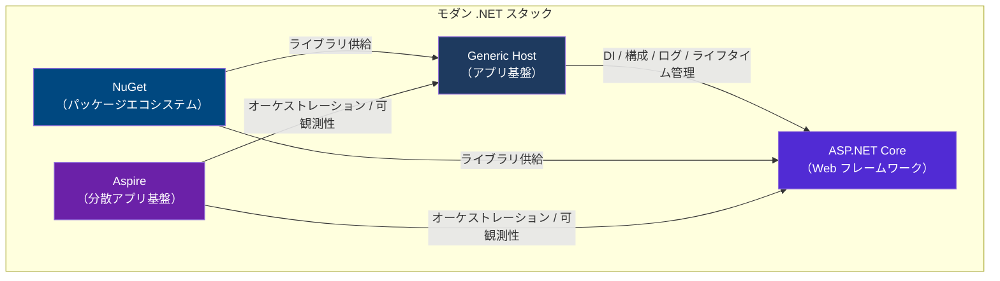

## はじめに 🌐

新しいWebサービスを立ち上げるとき、「どのフレームワークを選ぶか」はかなり重い意思決定です。Node.js、Go、Python/FastAPI、Ruby on Rails など有力な候補は多く、どれを選んでもある程度は戦えます。

そのうえで私は、**ASP.NET Core は Webサービスを書くための有力な選択肢のひとつ**だと考えています。理由は単純で、速く、業務で使いやすく、周辺エコシステムが強く、さらに最近は Aspire まで揃ってきたからです。

本記事はチュートリアルではなく、**技術選定の根拠を整理する記事**です。ASP.NET Core を中心に、パフォーマンス、エンタープライズ対応力、NuGet、Generic Host、Aspire という 5 つの観点から見ていきます。

:::message
本記事は筆者の実務経験と公式ドキュメントに基づく考察です。ASP.NET Core が万能だと言いたいわけではありません。最後に、別の選択肢が向いているケースも簡単に触れます。
:::

---

## ASP.NET Core とは 📘

[ASP.NET Core](https://learn.microsoft.com/ja-jp/aspnet/core/introduction-to-aspnet-core?WT.mc_id=DT-MVP-5004827) は、Microsoft が提供するクロスプラットフォーム・高パフォーマンス・オープンソースの Web フレームワークです。Windows だけでなく Linux や macOS でも動作し、コンテナ環境との相性も良好です。

.NET 5 以降はランタイムとしての「.NET Core」という名称が .NET に統合されましたが、Web フレームワーク名としての ASP.NET Core は引き続き使われています。本記事でもこの名称で統一します。



以降では、この図の各要素を切り口にしながら、ASP.NET Core が Webサービス開発で強い理由を順に整理します。

---

## 1. 動作が高速である ⚡

フレームワークを選ぶとき、まず気になるのはやはり速さです。

Microsoft は ASP.NET Core を次のように説明しています。

> ASP.NET Core is a cross-platform, high-performance, open-source framework for building modern web apps using .NET.
> — [Introduction to ASP.NET Core](https://learn.microsoft.com/ja-jp/aspnet/core/introduction-to-aspnet-core?WT.mc_id=DT-MVP-5004827)

この **high-performance** という位置づけは、単なる宣伝文句ではなく、日々の書き味にも表れています。特に Web API では I/O バウンドな処理が多くなりがちですが、`async` / `await` を前提にした非同期処理が自然に書けるため、多数のリクエストを扱うサービスでも設計しやすいです。

さらに、Minimal API のように薄いルーティング層を選べるのも強みです。軽量な API を素直に書けるので、「とりあえず速くてシンプルなものを作りたい」という要求にも応えやすいと感じます。

:::message
「他のフレームワークより何倍速い」という比較は、ベンチマーク条件に大きく左右されます。最終的には、自分のユースケースで計測するのが一番です。
:::

ただ、少なくとも **フレームワーク自体が性能面で不安材料になりにくい** というのは、Webサービス開発ではかなり大きいです。速さだけでは選べませんが、速さが土台として強いのは確かです。

---

## 2. エンタープライズレディーである 🏢

次に重要なのは、「業務で安心して使えるか」です。

ASP.NET Core の紹介ページでは、フレームワークが大規模アプリケーション向けに作られており、あらゆる規模のワークロードを扱える堅牢な選択肢だと説明されています。

> The framework is built for large-scale app development and can handle any size workload, making it a robust choice for enterprise-level apps.
> — [Introduction to ASP.NET Core](https://learn.microsoft.com/ja-jp/aspnet/core/introduction-to-aspnet-core?WT.mc_id=DT-MVP-5004827)

「エンタープライズレディー」と言うと少し曖昧ですが、私が重要だと思っているのは次の 4 点です。

### 信頼性・セキュリティ・スケーラビリティ

Microsoft は [Enterprise web app patterns](https://learn.microsoft.com/ja-jp/azure/architecture/web-apps/guides/enterprise-app-patterns/overview?WT.mc_id=DT-MVP-5004827) という形で、Web アプリをクラウドで信頼性高く運用するための指針を公開しています。そこでは、信頼性、セキュリティ、パフォーマンス、テスト容易性、スケーラビリティといった観点で、ASP.NET Core をどう使うかが体系立てて整理されています。

公式のアーキテクチャガイダンスがここまで揃っているのは、実運用を前提にしたフレームワークであることの強い裏付けです。

### 長期サポート（LTS）

.NET の偶数バージョンは LTS（Long Term Support）として提供され、**3 年間のサポート**があります。業務システムでは「来年すぐに大きな移行が必要になるかもしれない」という不安が少ないことが、とても重要です。

### 組み込みの認証・認可基盤

ASP.NET Core には認証・認可の仕組みが最初から整っており、Cookie、JWT Bearer、OpenID Connect などを標準的な形で組み込めます。Microsoft Entra ID との統合もしやすく、社内システムや業務システムとの相性が良いです。

### テストしやすい

DI が標準で組み込まれているため、コンポーネントの差し替えやモック化がしやすく、統合テスト向けの仕組みも揃っています。単に「動く」だけでなく、**保守し続けられる** という意味で、ASP.NET Core はかなり現場向きです。

また、Microsoft Learn にドキュメントが体系的にまとまっているので、設計・実装・運用の各段階で公式情報にあたりやすいのも、業務利用では地味に効いてきます。

速いだけでは長期運用には耐えません。ASP.NET Core の強さは、性能の上にこの運用しやすさが積み上がっているところにあります。

---

## 3. ライブラリーが充実している（NuGet）📦

どれだけ本体が優れていても、周辺ライブラリが乏しいと実開発では苦労します。

.NET の世界では、その土台になっているのが [NuGet](https://learn.microsoft.com/ja-jp/nuget/what-is-nuget?WT.mc_id=DT-MVP-5004827) です。Microsoft Learn では、NuGet を「.NET のコード共有を支える Microsoft サポートの仕組み」と説明しており、パッケージの作成・公開・利用の流れを定義する存在だと位置づけています。

> For .NET (including .NET Core), the Microsoft-supported mechanism for sharing code is NuGet, which defines how packages for .NET are created, hosted, and consumed.
> — [What is NuGet?](https://learn.microsoft.com/ja-jp/nuget/what-is-nuget?WT.mc_id=DT-MVP-5004827)

NuGet が強いのは、単にパッケージ数が多いからではありません。Webサービス開発で必要になる主要な関心事が、かなり高い水準で揃っていることです。

| 観点 | 代表例 | うれしい点 |
|------|--------|------------|
| 🗄️ **データアクセス** | EF Core、Dapper | ORM も軽量派も選べる |
| 🔐 **認証・認可** | JWT Bearer、Microsoft.Identity.Web | 業務システムの要求に乗せやすい |
| 📊 **可観測性** | OpenTelemetry、Serilog | ログ・トレース・メトリクスを組み込みやすい |
| 🧪 **テスト** | xUnit、FluentAssertions、NSubstitute | テスト基盤が整っている |
| 📨 **メッセージング** | MassTransit、Azure SDK | 非同期処理や連携処理に広げやすい |

「必要なものが大体ある」というのは、思っている以上に大きな強みです。特に長期プロジェクトでは、ライブラリの成熟度や保守性がそのまま開発速度に効いてきます。

---

## 4. Generic Host の書き味がよい 🛠️

私が ASP.NET Core を気に入っている理由のひとつが、土台にある [Generic Host](https://learn.microsoft.com/ja-jp/dotnet/core/extensions/generic-host?WT.mc_id=DT-MVP-5004827) の存在です。

Generic Host は、アプリの起動と終了、DI、構成、ログ、ライフタイム管理を一か所に集約する仕組みです。言い換えると、**アプリの骨格を素直に書ける** ということです。

```csharp
var builder = WebApplication.CreateBuilder(args);

builder.Services.AddControllers();
builder.Services.AddScoped<IMyService, MyService>();

// 設定を厳密に型指定して読み込む
builder.Services.Configure<MyOptions>(
    builder.Configuration.GetSection("MySettings"));

var app = builder.Build();

app.MapControllers();
app.Run();
```

この書き味のよさは、次の 4 つに集約できると思っています。

| 機能 | 役割 |
|------|------|
| ⚙️ **構成管理** | appsettings.json、環境変数、シークレットを統一的に扱える |
| 💉 **DI** | インターフェースと実装を自然に分離できる |
| 📝 **Logging** | 標準インターフェースでプロバイダーを差し替えやすい |
| 🔄 **ライフタイム管理** | グレースフルシャットダウンやバックグラウンド処理を扱いやすい |

この「全部ここに集まっている」感覚がとてもよいです。設定は別、ログは別、DI はまた別、というバラバラ感が少なく、新しく参加したメンバーでも全体像を追いやすいです。

Webサービスは、実際には API そのものよりも、その周辺の構成や運用コードに時間を使います。だからこそ、Generic Host のような**基盤の書き味**は意外と効いてきます。

---

## 5. Aspire の存在が大きい ☁️

そして今の .NET を語るうえで外せないのが **Aspire** です。以前は **.NET Aspire** という名前で呼ばれていましたが、現在は Aspire にリネームされています。

[Aspire](https://aspire.dev/get-started/what-is-aspire/) は、公式に **code-first orchestration and observability layer for distributed applications** と説明されています。要するに、分散アプリケーション全体をコードで定義し、起動し、観察するための基盤です。

Aspire の価値は、「マイクロサービスを書くための別フレームワーク」ではなく、**ASP.NET Core を含む複数サービスの開発体験を底上げするレイヤー**であることです。

特に良いのは次の点です。

1. **AppHost でシステム全体を定義できる**
2. **`aspire run` でまとめて起動できる**
3. **Dashboard でログやトレースを横断的に見られる**
4. **ローカル構成と本番構成の差分を整理しやすい**

分散アプリになると、「DB を起動して、キャッシュを起動して、API を起動して、ワーカーを起動して……」と開発体験が一気に複雑になります。Aspire はその面倒さをかなり減らしてくれます。

ASP.NET Core 単体でも十分に強いのですが、**Aspire があることで、複数サービスに広がったときの物語まで用意されている** のは大きいです。ここは今の .NET のかなり強いポイントだと思います。

---

## 比較まとめ：ASP.NET Core が Webサービス向きだと思う理由

| 観点 | ASP.NET Core の評価 | 補足 |
|------|--------------------|------|
| ⚡ **パフォーマンス** | ✅ 高い | フレームワーク自体が性能面で強い |
| 🏢 **エンタープライズ対応** | ✅ 強い | LTS、認証・認可、公式アーキテクチャガイドがある |
| 📦 **エコシステム** | ✅ 豊富 | NuGet によって主要な関心事を広くカバーできる |
| 🛠️ **開発体験** | ✅ 良好 | Generic Host が基盤部分をきれいに整理してくれる |
| ☁️ **分散アプリ対応** | ✅ 強い | Aspire が全体の開発体験を押し上げる |
| 🧪 **テスト容易性** | ✅ 優れている | DI 標準搭載でテストしやすい |
| 🎯 **学習コスト** | ⚠️ やや高め | C# / .NET の前提知識は必要 |

---

## それでも別の選択肢が向くケース 🤔

ここまでかなり褒めてきましたが、もちろん ASP.NET Core が常に最適というわけではありません。

- **チームが JavaScript / TypeScript に強い** なら、Node.js 系のほうが認知負荷を下げられることがあります。
- **単一バイナリや極小フットプリントを重視する** なら、Go がより素直な選択になることがあります。
- **探索的なプロトタイピングを最優先する** なら、Python や Ruby のほうが速く回せる場面もあります。

結局のところ、技術選定はチームとプロジェクトの文脈で決まります。ただ、その前提を踏まえても、ASP.NET Core は「とりあえず候補に入れる」ではなく、**かなり本命として検討できるフレームワーク**だと思っています。

---

## まとめ ✨

ASP.NET Core が Webサービス開発に向いている理由は、単発の強みではなく、複数の要素が噛み合っていることにあります。

1. **速い** — 高パフォーマンスなフレームワークとして位置づけられている
2. **業務で使いやすい** — LTS、認証・認可、設計ガイド、テスト基盤が揃っている
3. **ライブラリが豊富** — NuGet によって必要な部品を組み合わせやすい
4. **基盤の書き味がよい** — Generic Host が構成・DI・ログをきれいにまとめる
5. **将来の広がりがある** — Aspire が分散アプリ開発まで視野に入れてくれる

私は、Webサービスを書くなら ASP.NET Core はもっと真剣に評価されてよいと思っています。少なくとも「Microsoft の技術だから大企業向けで重そう」という昔のイメージだけで外すのは、かなりもったいないです。

もし次のプロジェクトでフレームワーク選定をするなら、ASP.NET Core を一度テーブルの中央に置いて比べてみてください。十分にその価値があります。🙌

---

## 参考リンク

- [Introduction to ASP.NET Core — Microsoft Learn](https://learn.microsoft.com/ja-jp/aspnet/core/introduction-to-aspnet-core?WT.mc_id=DT-MVP-5004827)
- [.NET Generic Host — Microsoft Learn](https://learn.microsoft.com/ja-jp/dotnet/core/extensions/generic-host?WT.mc_id=DT-MVP-5004827)
- [What is NuGet? — Microsoft Learn](https://learn.microsoft.com/ja-jp/nuget/what-is-nuget?WT.mc_id=DT-MVP-5004827)
- [Enterprise web app patterns — Microsoft Learn](https://learn.microsoft.com/ja-jp/azure/architecture/web-apps/guides/enterprise-app-patterns/overview?WT.mc_id=DT-MVP-5004827)
- [What is Aspire? — Aspire](https://aspire.dev/get-started/what-is-aspire/)
